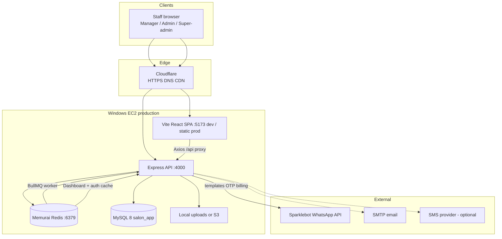
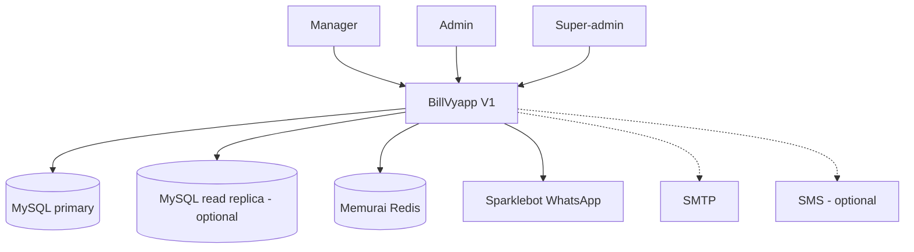
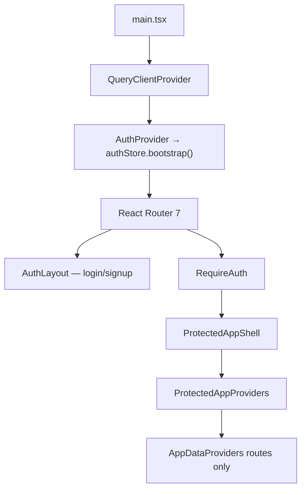
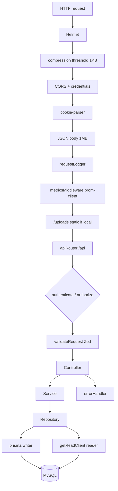
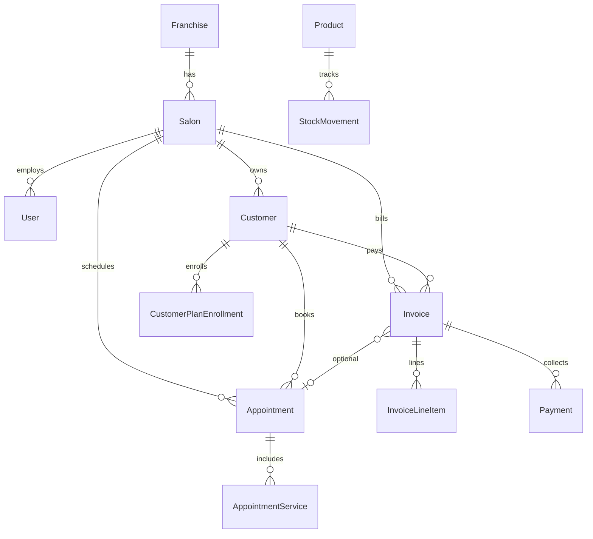
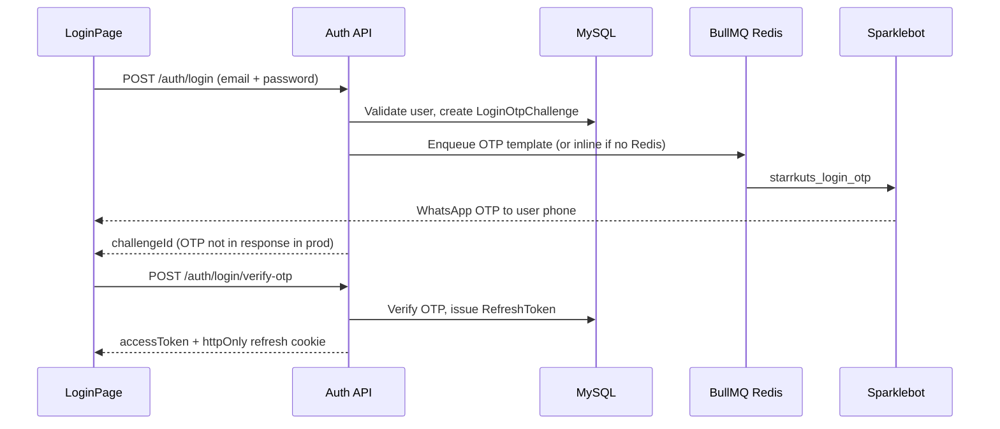
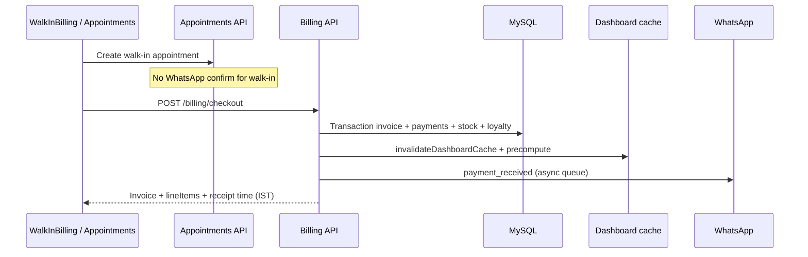
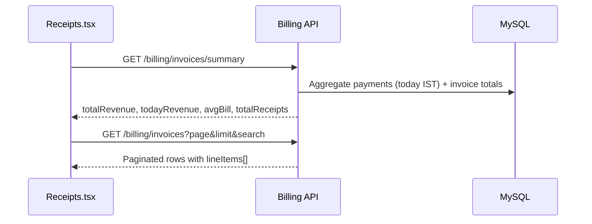
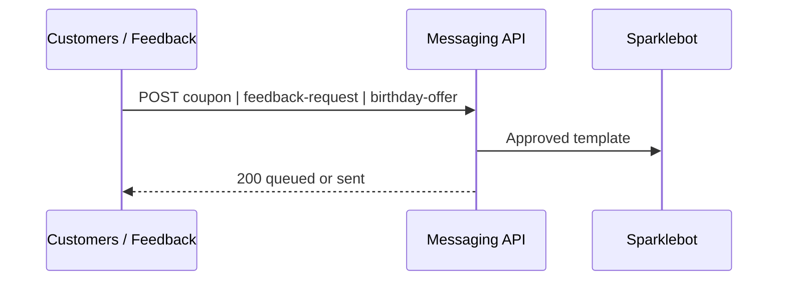

# BillVyapp — System Architecture (V1 Final)

> **Product:** BillVyapp · Salon billing & operations platform  
> **Client:** The Starr Kuts  
> **Status:** Production V1 — **final architecture document**  
> **Live:** https://billvyapp.com  
> **Last updated:** 22 August 2026  
> **Repos:** `Frontend folder/` (Vite + React SPA) · `backend/` (Express + Prisma + MySQL)

This document describes the **as-built V1 architecture** — what is deployed and maintained today. It replaces earlier design notes that referenced Next.js / PostgreSQL and supersedes all prior architecture drafts.

---

## Table of contents

1. [High-level overview](#1-high-level-overview)
2. [System context & actors](#2-system-context--actors)
3. [Repository layout](#3-repository-layout)
4. [Frontend architecture](#4-frontend-architecture)
5. [Backend architecture](#5-backend-architecture)
6. [Performance, caching & scale](#6-performance-caching--scale)
7. [Database (Prisma / MySQL)](#7-database-prisma--mysql)
8. [Authentication & authorization](#8-authentication--authorization)
9. [Time & revenue conventions (IST)](#9-time--revenue-conventions-ist)
10. [Domain modules (backend)](#10-domain-modules-backend)
11. [Domain modules (frontend)](#11-domain-modules-frontend)
12. [Integrations](#12-integrations)
13. [Key runtime flows](#13-key-runtime-flows)
14. [Infrastructure & deployment](#14-infrastructure--deployment)
15. [Configuration reference](#15-configuration-reference)
16. [Observability & ops](#16-observability--ops)
17. [Testing](#17-testing)
18. [V1 scope & out of scope](#18-v1-scope--out-of-scope)
19. [Related docs](#19-related-docs)
20. [Document control](#20-document-control)

---

## 1. High-level overview

BillVyapp is a **multi-tenant salon operations platform** for franchise salons. V1 delivers end-to-end salon operations from the front desk through finance and inventory.

| Capability | Description |
|------------|-------------|
| **Walk-in & appointments** | Book, queue, timeline, and complete salon visits (manager board) |
| **Billing / POS** | Checkout, GST, discounts, wallets, coupons, UPI QR, invoices, refunds |
| **Customers** | Profiles, visit history, receipts, memberships, loyalty, coupons |
| **Services & catalog** | Service categories, packages/plans, service–product links |
| **Inventory** | Products, vendors, purchases, stock adjustments, usage |
| **Finance** | Revenue Report (admin), receipts, pending payments, refunds, advances, memberships |
| **Expenses** | Expense ledger with manager delete-request / admin approval |
| **Accounting** | Day overview, cash denomination, budgets, day close |
| **Dashboards** | Admin (revenue KPIs + franchise panel) · Manager (operations KPIs) |
| **Notifications** | In-app feed + automated alerts · WhatsApp (Sparklebot) |
| **Super-admin** | Franchises & platform users |



**Stack (as built):**

| Layer | Technology |
|-------|------------|
| Frontend | React 18, TypeScript, Vite 6, Tailwind 4, Radix/ShadCN-style UI, Zustand, TanStack Query, React Router 7, Axios, Framer Motion, Recharts |
| Backend | Node.js ≥18, Express 4, TypeScript, Zod 4, Helmet, compression, cookie-parser, express-rate-limit |
| ORM / DB | Prisma 6 → **MySQL 8** (`relationMode = "prisma"`) |
| Auth | JWT access token + httpOnly refresh cookie |
| Cache / queues | Redis / Memurai — dashboard snapshots, auth user cache, BullMQ (WhatsApp) |
| Messaging | Sparklebot WhatsApp Business templates |
| Dev tooling | nodemon (backend hot reload), Vitest (unit/API), Playwright (frontend E2E) |
| Hosting | Windows EC2 + Cloudflare (primary prod path) |

---

## 2. System context & actors



| Actor | Access |
|-------|--------|
| **Manager** | Appointments board, walk-in billing, customers, inventory, pending payments, expenses (limited) |
| **Admin** | Revenue Report, full finance, expenses approval, dashboard revenue insights, franchise shop panel |
| **Accountant / Receptionist** | Billing list endpoints (invoices, summary) — backend role support |
| **Super-admin** | Franchises & platform users (`/super-admin`) |
| **Customer (indirect)** | Receives WhatsApp OTP / payment / coupon / feedback messages — no customer portal in V1 |

| External system | Role in V1 |
|-----------------|------------|
| **Sparklebot** | WhatsApp template sends (OTP, payment, coupons, feedback, appointments) |
| **MySQL** | System of record (primary); optional read replica for reporting |
| **Memurai / Redis** | Cache, dashboard precompute, auth context cache, BullMQ |
| **Cloudflare** | Public HTTPS edge for `billvyapp.com` |
| **SMTP** | Signup verification, password reset (configurable) |
| **SMS** | Alternate OTP channel (`SMS_ENABLED=false` by default) |
| **S3 / local** | File uploads (logos, documents) |

---

## 3. Repository layout

```
BillVyapp/
├── ARCHITECTURE.md              # This file (V1 final)
├── README.md                    # GitHub landing page
├── DATABASE_DESIGN_V1.md        # Legacy data design notes (verify against schema.prisma)
├── DATABASE_ARCHITECTURE_REVIEW_SQLSERVER.md
│
├── Frontend folder/             # Vite + React SPA
│   ├── src/
│   │   ├── app/
│   │   │   ├── pages/           # Feature pages (Dashboard, Appointments, Finance, …)
│   │   │   ├── pages/dashboard/ # Admin + Manager dashboards
│   │   │   ├── pages/appointments/board/  # Queue / timeline board
│   │   │   ├── pages/finance/     # Receipts sub-tabs, finance-ui
│   │   │   ├── pages/walkInBilling/  # 3-step POS
│   │   │   ├── components/        # Layout, shared UI, dialogs
│   │   │   ├── context/           # React contexts (legacy + data)
│   │   │   ├── config/            # navigation.ts, brand
│   │   │   ├── hooks/
│   │   │   └── lib/               # billingQueries, receiptLineItems, queryKeys
│   │   ├── api/                   # Axios API clients per domain
│   │   ├── stores/                # Zustand authStore
│   │   └── lib/                   # axios, queryClient, pagination, istDate
│   └── tests/                     # Playwright E2E
│
├── backend/
│   ├── prisma/
│   │   ├── schema.prisma
│   │   ├── migrations/          # 21+ migrations (see §7)
│   │   └── seed.ts
│   ├── src/
│   │   ├── bootstrap-timezone.ts  # Locks process TZ to IST
│   │   ├── app.ts                 # Express app + middleware chain
│   │   ├── server.ts              # Listen, Redis, BullMQ, graceful shutdown
│   │   ├── config/                # env, auth, redis, prisma, s3, whatsapp…
│   │   ├── middleware/            # errorHandler, validateRequest, rateLimit, metricsAuth
│   │   ├── modules/               # Domain modules (see §10)
│   │   ├── queues/                # BullMQ + WhatsApp worker
│   │   ├── routes/                # apiRouter + healthRoutes
│   │   ├── services/              # cache.service
│   │   └── utils/                 # ist, pagination, errors, logger, apiResponse
│   ├── uploads/                   # Local file storage (when S3 disabled)
│   ├── nodemon.json
│   └── .env.prod.example
│
├── docs/
│   ├── backend-mysql-pool.md
│   ├── backend-phase4-scale.md
│   ├── whatsapp-templates/
│   ├── sms-templates/
│   └── agile-analysis/
│
├── nginx/                       # Reference TLS / reverse-proxy configs
├── docker-compose.yml
└── docker-compose.prod.yml      # Reference container stack (not primary prod path)
```

**Git remotes**

| Remote | Repository | Typical use |
|--------|------------|-------------|
| `origin` | [MetaForge-IT/BillVyapp](https://github.com/MetaForge-IT/BillVyapp) | Development |
| `production` | [MetaForge-IT/BillVyapp-Production](https://github.com/MetaForge-IT/BillVyapp-Production) | EC2 deploy source |

---

## 4. Frontend architecture

### 4.1 Runtime

| Environment | Frontend | API |
|---------------|----------|-----|
| **Development** | Vite `:5173` — proxies `/api` → `http://localhost:4000` | `npm run dev` (nodemon); set `PORT=4000` in `.env` to match Vite proxy |
| **Production** | Static build behind Cloudflare / host web server | Node (default `PORT=3000` in `env.ts`; production uses host-configured port), `API_PREFIX=/api` |

Build env: `VITE_API_URL` (defaults to `/api` in dev via proxy).

### 4.2 Application bootstrap



| Layer | Location | Role |
|-------|----------|------|
| Root | `App.tsx` | TanStack Query + Auth + Router + Toaster |
| Auth gate | `RequireAuth.tsx` | Waits `isReady`, redirects unauthenticated |
| Role gate | `RequireRole.tsx` | Route-level RBAC |
| Shell providers | `ProtectedAppProviders.tsx` | Settings, Role, Notifications, Dashboard (all protected pages) |
| Data providers | `AppDataProviders.tsx` | Products, ServiceProducts, Incentives, Receipts, PendingPayments, Advances, Appointments, Coupons — **not mounted on Dashboard** |
| Auth session | `stores/authStore.ts` | JWT persist, bootstrap, refresh, `ensureFreshAccessToken()` |
| HTTP | `lib/axios.ts` | Bearer header, 401 → cookie refresh retry |

### 4.3 State management strategy

| Pattern | Used for |
|---------|----------|
| **Zustand** (`authStore`) | Access token, `isAuthenticated`, bootstrap |
| **TanStack Query** | Dashboard, paginated lists (customers, receipts), notifications |
| **React Context** | Role, settings, legacy working-set caches (receipts, appointments, products) |
| **URL search params** | Finance tabs (`?tab=receipts&section=pending`), appointment filters, receipt date drill-down |

Query keys live in `app/lib/queryKeys.ts`. List working-set limit: `LIST_WORKING_LIMIT = 200` (matches API `MAX_PAGE_LIMIT`).

### 4.4 Navigation (sidebar)

Defined in `app/config/navigation.ts`:

| Section | Items | Roles |
|---------|-------|-------|
| Operations | Dashboard, Billing (walk-in), Appointments | manager for billing/appts |
| Customers | Customers | all |
| Services | Services | all |
| Finance | Revenue Report, Pending Payments, Expenses | admin / manager split |
| Inventory | Inventory | all |

Legacy routes (employees, reports, marketing, settings, CEO dashboard, AI insights, coupons) **redirect to `/dashboard`** — code retained, not deleted.

### 4.5 Primary routes

| Path | Role | Module |
|------|------|--------|
| `/`, `/landing` | Public | Marketing |
| `/login`, `/signup`, `/forgot-password`, `/reset-password` | Public | Auth |
| `/dashboard` | Authenticated | Admin or Manager dashboard |
| `/appointments`, `/appointments/new` | Manager | Appointments board + booking |
| `/walk-in` | Manager | Walk-in entry (redirects to appointments walk-in flow) |
| `/customers`, `/customers/new` | Authenticated | CRM |
| `/services`, `/services?tab=packages` | Authenticated | Service catalog & packages |
| `/inventory` | Authenticated | Stock, vendors, orders |
| `/memberships` | Authenticated | Plans & tiers (route active; not in primary sidebar nav) |
| `/finance?tab=receipts` | Admin / Manager | Revenue Report or Pending (role-based title) |
| `/expenses` | Admin, Manager | Expenses |
| `/feedback` | Authenticated | Feedback |
| `/notifications` | Authenticated | In-app notifications |
| `/profile`, `/help` | Authenticated | Profile & support |
| `/super-admin/*` | Super-admin | Franchises & users |

**Finance module (admin vs manager)**

- **Admin** sees **Revenue Report**: KPI stat cards (total/today revenue, avg bill, receipt count), searchable receipt list, refresh button.
- **Manager** sees **Pending Payments** by default; can switch to paid receipts (`section=sales`).
- Sub-tabs inside receipts: Sales, Refunds, Pending, Advance, Membership (`FinanceReceiptsModule.tsx`).

**Retained but not routed in V1:** `FinanceAccountingModule.tsx` (accounting overview, cash flow, day close, budgets, reports) — backend `/api/accounting` is live; Expenses page uses the accounting API; full accounting UI is not linked from Finance nav (receipts only per product scope).

### 4.6 Walk-in billing UX

Three-step POS in `pages/walkInBilling/`:

1. **Services** — pick services/products  
2. **Customer** — find or create customer  
3. **Bill** — discounts, GST, payment method (cash/card/UPI QR/wallet/split), checkout  

Post-payment: receipt preview with **per-line-item amounts** (not equal split), optional star feedback.

### 4.7 Appointments board

`pages/appointments/board/` — queue + timeline views for manager operations:

- `QueueBoard.tsx`, timeline types, edit/notify dialogs  
- Integrated billing from appointment cards  
- Walk-in and scheduled flows share appointment APIs  

### 4.8 Receipts & billing display

| Concern | Implementation |
|---------|----------------|
| Line item amounts | API returns `lineItems: [{ name, amount, quantity, unitPrice }]` on every invoice list row |
| Display helper | `app/lib/receiptLineItems.ts` → `receiptLinesForDisplay()` |
| Preview | `ReceiptPreviewDialog.tsx`, inline preview in `Receipts.tsx` |
| Download/print | `downloadReceipt.ts` — HTML receipt with per-line amounts |
| Customer receipts | `CustomerReceiptsModal.tsx` + visit `meta.lineItems` from customers API |

### 4.9 Revenue KPI alignment

**Today's Revenue** is consistent across Dashboard, Customers panel, and Revenue Report:

- Source of truth: **sum of payments by `paidAt` in IST day window** (not invoice date, not equal-split line math).
- Revenue Report stats: `GET /api/billing/invoices/summary` (admin only stat cards).
- Dashboard: `GET /api/dashboard` → `businessKpis.todayRevenue`.
- Customers header KPI: `GET /api/accounting/overview?date=YYYY-MM-DD` → `totalSales` (IST payment window).

Search on Revenue Report **does not** alter KPI stat cards (summary is salon-wide; list is filtered).

---

## 5. Backend architecture

### 5.1 Request pipeline



Entry points:

- `backend/src/app.ts` — Express application  
- `backend/src/server.ts` — HTTP listen, Redis connect, BullMQ workers, graceful shutdown  
- `backend/src/bootstrap-timezone.ts` — Sets `TZ=Asia/Kolkata` before other imports  
- `backend/src/routes/index.ts` — mounts all module routers under `API_PREFIX` (default `/api`)

### 5.2 Module pattern

Each feature module typically includes:

```
modules/<name>/
  *.routes.ts       # Router + authenticate/authorize
  *.controller.ts   # HTTP handlers (asyncHandler)
  *.service.ts      # Business logic, cache invalidation
  *.repository.ts   # Prisma queries
  *.validators.ts   # Zod schemas (+ validateRequest middleware)
  *.constants.ts    # Error codes, status enums
```

Cross-cutting: `email/`, `sms/`, `whatsapp/`, `notifications/` (orchestration), `services/cache.service.ts`.

### 5.3 Validation & pagination

- **`middleware/validateRequest.ts`** — shared Zod body/query validation (used across 20+ route files).
- **`utils/pagination.ts`** — `MAX_PAGE_LIMIT = 200`, shared `paginationQuerySchema`, `toPaginatedResult()`.
- Billing list supports `?detail=1` for full line items + payments on a single invoice fetch; list endpoints always include lightweight `lineItems` summary.

### 5.4 API surface (mounted routers)

| Mount | Module | Notes |
|-------|--------|-------|
| `/api/health` | Health | Liveness + Redis status |
| `/api/health/messaging` | Health | Channel connectivity |
| `/api/metrics` | Metrics | Prometheus (`METRICS_TOKEN` required) |
| `/api/auth` | Auth | Login OTP, refresh, register, password reset |
| `/api/franchises` | Franchises | Super-admin franchise CRUD |
| `/api/my-franchise` | My franchise | Admin shop addresses / managers |
| `/api/customers` | Customers | CRM, visits, loyalty, memberships |
| `/api/dashboard` | Dashboard | Cached KPI aggregates |
| `/api/notifications` | App notifications | In-app feed + unread count |
| `/api/messaging` | Messaging | Staff-triggered WhatsApp |
| `/api/appointments` | Appointments | Scheduling + status |
| `/api/services` | Services | Catalog + bulk upload |
| `/api/service-categories` | Service categories | |
| `/api/product-categories` | Product categories | |
| `/api/products` | Products | |
| `/api/vendors` | Vendors | |
| `/api/stock-purchases` | Stock purchases | |
| `/api/stock-adjustments` | Stock adjustments | |
| `/api/inventory` | Inventory | Stats / movements |
| `/api/billing` | Billing | Checkout, invoices, summary, pending, refunds |
| `/api/feedback` | Feedback | Ratings |
| `/api/plans` | Plans | Salon packages |
| `/api/coupons` | Coupons | Promo codes |
| `/api/membership-tiers` | Membership tiers | |
| `/api/settings` | Settings | Salon config |
| `/api/staff` | Staff | Staff users |
| `/api/uploads` | Uploads | Local or S3 |
| `/api/search` | Search | Global search (FULLTEXT + fallback) |
| `/api/advances` | Advances | Customer advances |
| `/api/accounting` | Accounting | Overview, expenses, budgets, day close |
| `/api/service-product-links` | Service–product links | Consumption mapping |

**Billing endpoints (key)**

| Method | Path | Purpose |
|--------|------|---------|
| POST | `/billing/confirm-only` | Confirm appointment without payment |
| POST | `/billing/checkout` | Full checkout + payment |
| POST | `/billing/:id/collect` | Collect partial / follow-up payment |
| GET | `/billing/invoices` | Paginated receipt list (`search`, `page`, `limit`, `detail`) |
| GET | `/billing/invoices/summary` | Salon-wide revenue KPIs (no search filter) |
| GET | `/billing/pending` | Unpaid / partial invoices |
| GET | `/billing/refunds` | Refund queue |
| POST | `/billing/:id/refund/request` | Manager refund request |
| POST | `/billing/:id/refund/approve` | Admin PIN approval |
| POST | `/billing/:id/refund/reject` | Reject refund |

Default in code: `PORT=3000` (`env.ts`). Local dev convention: **`PORT=4000`** to align with `Frontend folder/vite.config.ts` proxy target.

---

## 6. Performance, caching & scale

Four optimization phases are implemented (Aug 2026):

### Phase 1 — Critical path

| Change | Detail |
|--------|--------|
| OTP fire-and-forget | WhatsApp OTP enqueue does not block login response (~20s saved) |
| Receipt sequence in transaction | Atomic receipt number inside checkout transaction |
| Dashboard invalidation wired | Writes call `invalidateDashboardCache(salonId)` |
| Payment aggregate on dashboard | Single grouped query vs N+1 |
| `/api/metrics` protected | Requires `METRICS_TOKEN` |
| nodemon dev | Hot reload via `nodemon.json` |

### Phase 2 — Query efficiency

| Change | Detail |
|--------|--------|
| Dashboard batch queries | `dashboard.queries.ts` — batched payment/appointment aggregates |
| Batch line-item resolution | Billing checkout resolves line items in batch |
| Prisma indexes | Migration `20260822170000_phase2_performance_indexes` |
| Auth context Redis cache | `authContextCache.ts` — TTL `REDIS_AUTH_USER_TTL_SECONDS` |

### Phase 3 — API hygiene

| Change | Detail |
|--------|--------|
| Shared `validateRequest` | Zod validation middleware on route inputs |
| Pagination cap | `MAX_PAGE_LIMIT = 200` on all list endpoints |
| Response compression | `compression` middleware (1 KB threshold) |
| Invoice list modes | `?detail=1` for full invoice payload |
| MySQL pool docs | `docs/backend-mysql-pool.md` |

### Phase 4 — Scale

| Change | Detail |
|--------|--------|
| Dashboard precompute | On write: invalidate + rebuild Redis snapshot (`DASHBOARD_PRECOMPUTE=true`) |
| Read replica | Optional `DATABASE_URL_READ` → `getReadClient()` for dashboard + search |
| Rate limiting | **Login only** — 10 req/min/IP on login + OTP routes (not global API) |
| FULLTEXT search | Migration `20260822180000_phase4_fulltext_search` on customers + services |

See `docs/backend-phase4-scale.md` for deployment checklist.

### Caching layers

| Key pattern | TTL | Purpose |
|-------------|-----|---------|
| `dashboard:{salonId}` | `REDIS_DASHBOARD_SNAPSHOT_TTL_SECONDS` | Precomputed dashboard JSON |
| `auth:user:{userId}` | `REDIS_AUTH_USER_TTL_SECONDS` | Auth middleware user context |
| BullMQ queues | — | Async WhatsApp sends |

Invalidation triggers: billing checkout/collect/refund, appointment status changes, customer writes.

---

## 7. Database (Prisma / MySQL)

**ORM:** Prisma 6  
**Engine:** MySQL 8  
**Relation mode:** `prisma` (no FK enforcement at DB level — app-enforced)  
**Migrations:** `backend/prisma/migrations/*` — deploy with `npx prisma migrate deploy`

### 7.1 Migration history (high level)

| Migration | Purpose |
|-----------|---------|
| `20260702121811_init` | Core schema |
| `20260702140000_email_verification_tokens` | Email verify |
| `20260707140000_invoice_payment_balance` | Partial payments |
| `20260707160000_salon_plans` | Package plans |
| `20260708120000_service_category_description` | Catalog |
| `20260708130000_service_tax` | GST on services |
| `20260708133000_feedback_status` | Feedback workflow |
| `20260708134500_advances_service_links` | Advances |
| `20260708140000_inventory_product_categories` | Inventory |
| `20260710180000_service_popularity` | Service ranking |
| `20260710190000_accounting` | Expenses, budgets, day close |
| `20260711120000_wallet_transactions` | Wallet ledger |
| `20260720140000_login_otp_challenges` | WhatsApp OTP login |
| `20260728143000_invoice_manual_discount_reason` | Manual discount audit |
| `20260729150000_service_catalog_v2` | Catalog v2 fields |
| `20260730153000_customer_source` | Customer acquisition source |
| `20260730173000_franchise_shops` | Multi-shop franchise |
| `20260805140000_expense_delete_requests` | Expense delete workflow |
| `20260805143000_expense_delete_rejected` | Rejection tracking |
| `20260822170000_phase2_performance_indexes` | Performance indexes |
| `20260822180000_phase4_fulltext_search` | FULLTEXT search |

### 7.2 Domain model groups

| Domain | Models |
|--------|--------|
| **Tenancy** | `Franchise`, `Salon`, `BusinessHour` |
| **Identity** | `User`, `RefreshToken`, `PasswordResetToken`, `EmailVerificationToken`, `LoginOtpChallenge` |
| **Salon settings** | `SalonFinancialSettings`, `SalonNotificationSettings` |
| **CRM** | `Customer`, `CustomerPreference`, `Feedback` |
| **Loyalty / membership** | `MembershipTier`, `CustomerMembership`, `LoyaltyTransaction`, `WalletTransaction`, `SalonPlan`, `SalonPlanService`, `CustomerPlanEnrollment`, `Package`, `PackageService` |
| **Catalog** | `ServiceCategory`, `Service`, `ServiceProductLink` |
| **Inventory** | `ProductCategory`, `Vendor`, `Product`, `StockMovement`, `PurchaseOrder`, `PurchaseOrderItem` |
| **Scheduling** | `Appointment`, `AppointmentService` |
| **Billing** | `Invoice`, `InvoiceLineItem`, `Payment`, `Coupon`, `CouponRedemption`, `CustomerAdvance` |
| **Finance ops** | `Expense`, `BudgetPeriod`, `BudgetLine`, `DayClose` |
| **Comms** | `Notification` |



### 7.3 Connection pooling

Configure via `DATABASE_URL` query params — see `docs/backend-mysql-pool.md`:

```
?connection_limit=10&pool_timeout=20&connect_timeout=10
```

Optional read replica: `DATABASE_URL_READ` (see Phase 4).

---

## 8. Authentication & authorization

### 8.1 Login sequence (WhatsApp OTP)



| Token | Storage | Purpose |
|-------|---------|---------|
| **Access JWT** | Zustand persist (`salon-auth`) | `Authorization: Bearer` on API calls (15m default) |
| **Refresh** | httpOnly cookie `salon_refresh_token`, path `/` | Rotate via `POST /api/auth/refresh` |

Frontend `authStore.bootstrap()` on load: rehydrate → refresh cookie → set `isReady`.  
`ensureFreshAccessToken()` proactively refreshes before notifications fetch when near expiry.

Axios interceptor: on 401 (except auth paths), attempt one refresh + retry; clear session if refresh fails.

### 8.2 Authorization middleware

| Middleware | Purpose |
|------------|---------|
| `authenticate` | Valid JWT → `req.auth` (`userId`, `salonId`, `franchiseId`, `role`) |
| `authorize(...roles)` | Role allow-list per route |
| `requireManager` | Legacy manager-only guard |

**Roles in V1:** `manager`, `admin`, `accountant`, `receptionist`, `super_admin`.

Frontend mirrors with `<RequireAuth />` and `<RequireRole roles={[…]} />`.  
Role claims from JWT via `RoleContext`.

### 8.3 Rate limiting

**Login-only** (not global API — avoids blocking normal staff traffic):

| Route | Limit |
|-------|-------|
| `POST /api/auth/login` | 10 req/min/IP |
| `POST /api/auth/login/verify-otp` | 10 req/min/IP |
| `POST /api/auth/login/resend-otp` | 10 req/min/IP |

Redis-backed when `REDIS_URL` set; in-memory fallback per process. Disabled in `NODE_ENV=test`.

---

## 9. Time & revenue conventions (IST)

All salon calendar logic uses **India Standard Time (UTC+5:30)** regardless of host timezone (US EC2 safe).

| Utility | File | Purpose |
|---------|------|---------|
| `istDateKey()` | `backend/src/utils/ist.ts` | Today as `YYYY-MM-DD` in IST |
| `startOfIstDay()` / `istDayRange()` | same | `paidAt` filters for revenue |
| `istWallClockAsUtcTime()` | same | Store `@db.Time` invoice time as IST wall clock |
| `formatWallClockTime12h()` | same | Display bill time without +5:30 double conversion |
| `formatDbDateKey()` | same | Serialize `@db.Date` columns |
| `toIstDateKey()` | `Frontend folder/src/lib/istDate.ts` | Frontend IST date helper |

**Revenue definitions**

| Metric | Calculation |
|--------|-------------|
| Today's Revenue | Sum of `Payment.amount` where `paidAt` ∈ IST today |
| Total Revenue (report) | Sum of all non-void invoice `totalAmount` (summary endpoint) |
| Receipt time on bill | `Invoice.invoiceTime` stored as IST wall clock |

---

## 10. Domain modules (backend)

| Folder | Responsibility |
|--------|----------------|
| `auth` | Login, OTP, refresh, password reset, registration, email verify |
| `customers` | CRM CRUD, visits (with line items), memberships, loyalty redeem |
| `appointments` | CRUD, status, board queries; WhatsApp confirm for **scheduled** only |
| `billing` | confirm-only, checkout, collect, refunds, invoice list + **summary** |
| `messaging` | Staff WhatsApp: coupon, feedback-request, birthday-offer |
| `whatsapp` | Sparklebot provider, templates, orchestration |
| `notifications` | Multi-channel orchestration (email / WhatsApp / SMS stubs) |
| `app-notifications` | In-app feed, generators (pending bills, stock alerts, …) |
| `dashboard` | Cached KPI aggregates, weekly trends, top services |
| `services` / `service-categories` | Service catalog (+ seed/bulk) |
| `products` / `product-categories` / `vendors` | Inventory masters |
| `inventory` / `stock-purchases` / `stock-adjustments` | Stock movements |
| `plans` / `membership-tiers` / `coupons` | Memberships & promos |
| `accounting` / `advances` | Finance ledger, expenses, budgets, day close |
| `feedback` | Store / list / update feedback |
| `franchises` / `my-franchise` | Multi-salon tenancy |
| `uploads` | Local or S3 file storage |
| `search` | Cross-entity search (FULLTEXT ≥3 chars) |
| `settings` / `staff` | Salon settings & staff users |
| `email` / `sms` | Provider adapters |

---

## 11. Domain modules (frontend)

| UI area | Key files | Backend |
|---------|-----------|---------|
| Admin Dashboard | `dashboard/AdminDashboard.tsx`, `RevenueInsights.tsx`, `KpiGrid.tsx` | `dashboard` |
| Manager Dashboard | `dashboard/ManagerDashboard.tsx`, `ManagerKpiGrid.tsx` | `dashboard` |
| Appointments board | `pages/Appointments.tsx`, `appointments/board/*` | `appointments`, `billing` |
| Walk-in billing | `pages/walkInBilling/*`, `DirectBillDialog.tsx` | `appointments`, `billing/checkout` |
| Customers | `pages/Customers.tsx`, `CustomerReceiptsModal.tsx` | `customers`, `messaging` |
| Revenue Report | `pages/Receipts.tsx`, `FinanceReceiptsModule.tsx` | `billing/invoices`, `billing/invoices/summary` |
| Expenses | `pages/Expenses.tsx`, `AccountingExpenses.tsx` | `accounting` |
| Inventory | `pages/inventory/*` | products, vendors, stock APIs |
| Services | `pages/Services.tsx`, `Packages.tsx` | `services`, `plans` |
| Notifications | `pages/Notifications.tsx`, `NotificationsContext.tsx` | `notifications` |
| Super-admin | `pages/super-admin/*` | `franchises` |
| Login OTP | `pages/auth/LoginPage.tsx` | `auth` + WhatsApp |

**Provider mount strategy**

| Provider | Mounted on |
|----------|------------|
| `DashboardProvider` | All protected pages (via `ProtectedAppProviders`) |
| `NotificationsProvider` | All protected pages |
| `ReceiptsProvider`, `AppointmentProvider`, etc. | `AppDataProviders` routes only (not Dashboard) |

---

## 12. Integrations

### 12.1 WhatsApp (Sparklebot) — production V1

| Item | Value |
|------|--------|
| Provider | `WHATSAPP_PROVIDER=sparklebot` |
| API | `https://sparklebot.in/api/v1/{tenant}/messages/template` |
| Language | `en_IN` |
| Queue | BullMQ when `REDIS_URL` set; else **inline send** |

**Triggered messages**

| Event | Template |
|-------|----------|
| Login OTP | `starrkuts_login_otp` |
| Scheduled appointment confirm | `starrkuts_appt_confirm` |
| Payment received | `starrkuts_payment_received` |
| Coupon send | `starrkuts_coupon_send` |
| Feedback request | `starrkuts_feedback_request` |
| Birthday offer | `starrkuts_birthday_offer` |

Walk-in checkout: **payment received only** (no appointment confirmation).

### 12.2 Redis / Memurai + BullMQ

- **Windows (local + EC2):** Memurai `127.0.0.1:6379`  
- **Compose reference:** `redis://redis:6379`  
- Without Redis: WhatsApp inline; dashboard cache disabled; auth user cache disabled

### 12.3 Email / SMS / Payments / Files

| Integration | V1 status |
|-------------|-----------|
| SMTP | Implemented — configure `SMTP_*` for verify/reset |
| SMS | Adapters present — `SMS_ENABLED=false` default |
| Razorpay | **Not integrated** — UPI QR + manual confirmation |
| Files | `FILES_STORAGE=local` or `s3` |

---

## 13. Key runtime flows

### 13.1 Walk-in payment



### 13.2 Revenue Report refresh (admin)



### 13.3 Staff coupon / feedback WhatsApp



### 13.4 Expense delete approval

1. Manager submits delete request on expense  
2. Admin sees pending request in Expenses UI  
3. Admin approves → expense removed; rejects → flagged on record  

---

## 14. Infrastructure & deployment

### 14.1 Production (live path)

| Component | Arrangement |
|-----------|-------------|
| Host | **Windows Server on EC2** (RDP) |
| App | Node processes (`npm run build` + `npm start` / PM2-style) |
| DB | MySQL on host / LAN (`DATABASE_URL`) |
| Queue / cache | **Memurai** Windows service · `REDIS_URL=redis://127.0.0.1:6379` |
| Edge | **Cloudflare** → https://billvyapp.com |
| Deploy | `git pull` from `production` remote → `npm install` → `prisma migrate deploy` → restart API + rebuild frontend |

### 14.2 Docker Compose (reference only)

`docker-compose.prod.yml` — Redis, API, frontend, nginx TLS, Prometheus, Grafana for Linux/container deploys. **Current Starr Kuts production uses the Windows EC2 path.**

### 14.3 Local development

```text
Frontend folder/  →  npm run dev        →  :5173  (proxy /api → :4000)
backend/          →  npm run dev        →  :4000  (nodemon)
Memurai/Redis     →  :6379              →  optional (recommended)
MySQL             →  DATABASE_URL
```

---

## 15. Configuration reference

Grouped environment variables (see `backend/.env.prod.example`):

| Category | Keys (examples) |
|----------|-----------------|
| Runtime | `NODE_ENV`, `PORT`, `APP_NAME`, `LOG_LEVEL`, `API_PREFIX` |
| Database | `DATABASE_URL`, `DATABASE_URL_READ` (optional) |
| Auth | `JWT_ACCESS_*`, `JWT_REFRESH_*`, `REFRESH_COOKIE_*`, `LOGIN_OTP_*` |
| URLs | `CORS_ORIGIN`, `FRONTEND_URL`, `API_PUBLIC_URL` |
| Redis | `REDIS_URL`, `REDIS_DASHBOARD_*`, `REDIS_AUTH_USER_TTL_SECONDS`, `DASHBOARD_PRECOMPUTE` |
| Rate limit | `RATE_LIMIT_ENABLED`, `RATE_LIMIT_WINDOW_MS`, `RATE_LIMIT_AUTH_MAX` |
| WhatsApp | `WHATSAPP_*`, `VERIFICATION_CHANNELS` |
| SMS | `SMS_ENABLED`, `SMS_PROVIDER` |
| SMTP | `SMTP_*` |
| Files | `FILES_STORAGE`, `LOCAL_UPLOAD_DIR`, `AWS_*` |
| Billing | `REFUND_APPROVAL_PIN` |
| Observability | `SENTRY_DSN`, `SENTRY_ENVIRONMENT`, `METRICS_TOKEN` |

Frontend build: `VITE_API_URL`, `VITE_SENTRY_DSN`.

**Never commit** real `.env` files, tokens, or secrets.

---

## 16. Observability & ops

| Concern | Mechanism |
|---------|-----------|
| Structured logs | Backend logger (JSON in production) |
| Health | `GET /api/health` (+ Redis status when configured) |
| Messaging health | `GET /api/health/messaging` |
| Errors | Central `errorHandler`; optional Sentry (`@sentry/node`, `@sentry/react`) |
| Metrics | `prom-client` middleware; `GET /api/metrics` (token-gated) |
| Queues | BullMQ workers started from `server.ts` when Redis connects |
| Graceful shutdown | SIGTERM/SIGINT → stop workers, disconnect Prisma + Redis |

---

## 17. Testing

| Layer | Tool | Location |
|-------|------|----------|
| Backend unit/API | Vitest | `backend/src/**/*.test.ts` |
| Frontend unit | Vitest + Testing Library | `Frontend folder/` |
| Frontend E2E | Playwright | `Frontend folder/tests/` (dashboard, billing, memberships, help) |

Run:

```bash
cd backend && npm run test
cd "Frontend folder" && npm run test
```

Typecheck:

```bash
cd backend && npx tsc --noEmit
cd "Frontend folder" && npm run typecheck
```

---

## 18. V1 scope & out of scope

### In scope (delivered)

- Manager / Admin / Super-admin app surfaces  
- Appointments board + walk-in POS  
- Customers, services, inventory, memberships  
- Billing with GST, discounts, wallets, coupons, UPI QR, per-line receipt amounts  
- Revenue Report with KPI summary + refresh (admin)  
- Expenses with delete-request / admin approval workflow  
- In-app notifications with proactive token refresh  
- WhatsApp via Sparklebot (OTP, payment, coupons, feedback, scheduled appt confirm)  
- Performance phases 1–4 (caching, indexes, read replica support, login rate limit)  
- IST-correct bill times and revenue KPIs  
- Production deployment on Windows EC2 + Cloudflare  

### Explicitly deferred / waiting

| Item | Notes |
|------|-------|
| Razorpay / online gateway | UPI QR + manual confirmation |
| Customer self-service portal | Not in V1 |
| Global API rate limiting | Removed — login-only limiter |
| Full marketing / AI / CEO suites | Routes redirect to dashboard |
| SMTP/SMS full production cutover | Configurable; provider credentials per deploy |

---

## 19. Related docs

| Document | Purpose |
|----------|---------|
| [README.md](./README.md) | Project landing |
| [docs/backend-mysql-pool.md](./docs/backend-mysql-pool.md) | MySQL connection pool tuning |
| [docs/backend-phase4-scale.md](./docs/backend-phase4-scale.md) | Read replica, snapshots, rate limits, FULLTEXT |
| [docs/BillVyapp-Project-Status-Report-2026-08-07.md](./docs/BillVyapp-Project-Status-Report-2026-08-07.md) | Phase status report |
| [docs/whatsapp-templates/](./docs/whatsapp-templates/) | WhatsApp template catalog |
| [docs/sms-templates/](./docs/sms-templates/) | SMS DLT templates |
| [DATABASE_DESIGN_V1.md](./DATABASE_DESIGN_V1.md) | Earlier data design (verify against `schema.prisma`) |
| `backend/.env.prod.example` | Production env template |
| `docker-compose.prod.yml` | Optional container architecture |

---

## 20. Document control

| Version | Date | Notes |
|---------|------|-------|
| V1 draft | Aug 2026 | Initial as-built: Vite/React + Express + MySQL + Sparklebot |
| **V1 final** | **22 Aug 2026** | Complete architecture: perf phases 1–4, IST/revenue/line-item fixes, login-only rate limit, provider split, all modules & routes, finance/receipt architecture, testing & config reference |

For module ownership or extendability, start from:

- Backend: `backend/src/modules/` + `backend/src/routes/index.ts`  
- Frontend: `Frontend folder/src/app/routes.tsx` + `app/config/navigation.ts`  
- Database: `backend/prisma/schema.prisma`
