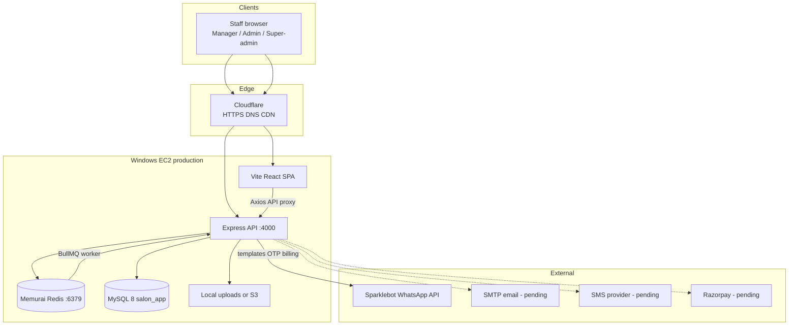
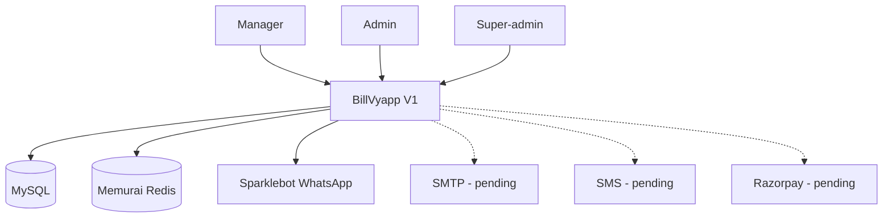
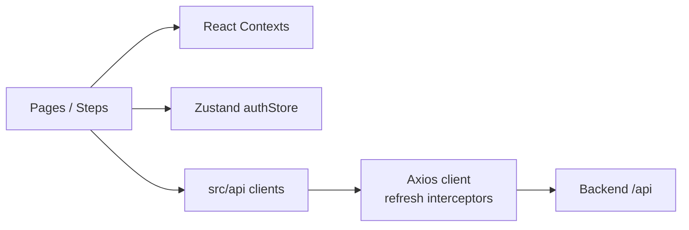
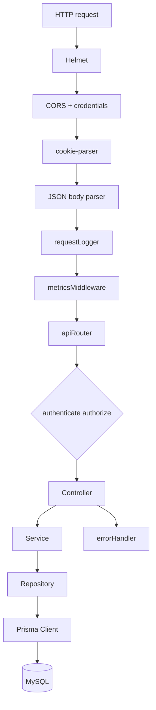
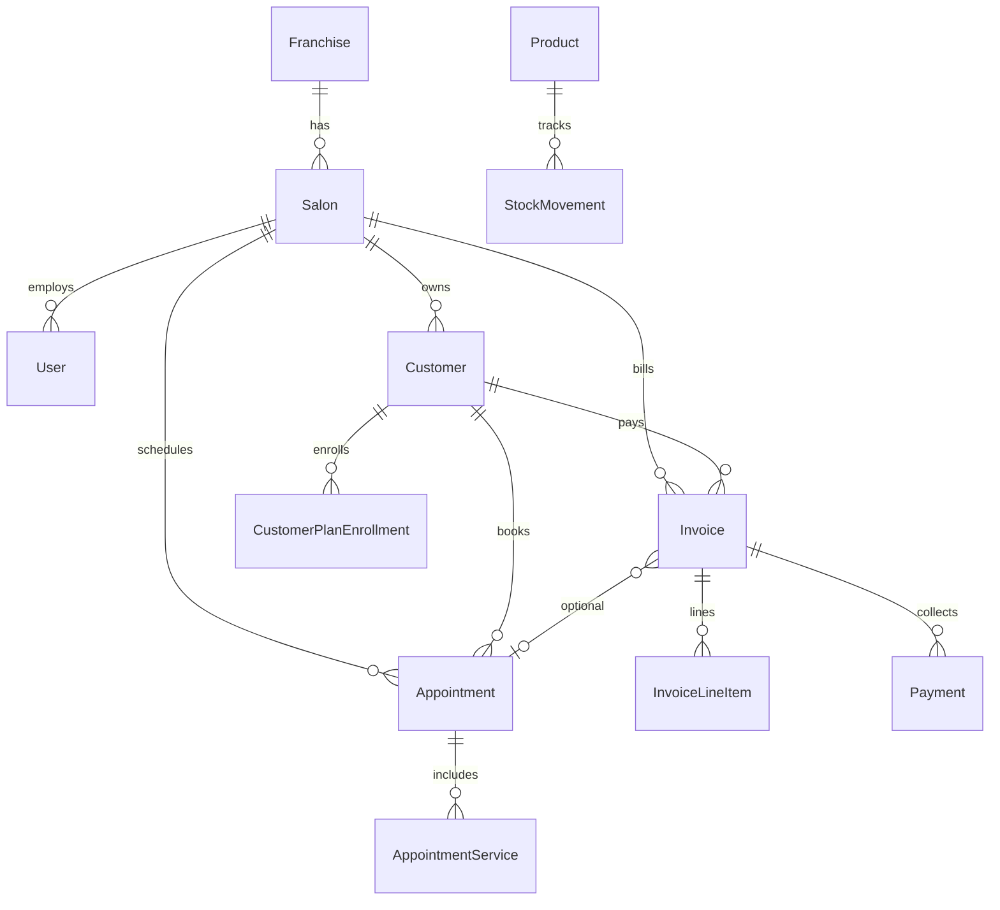
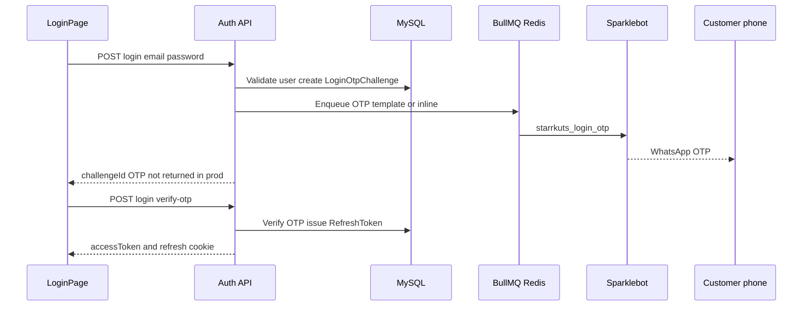
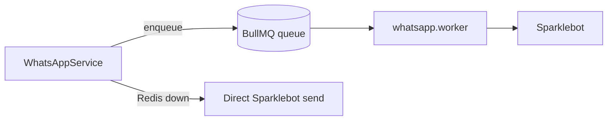
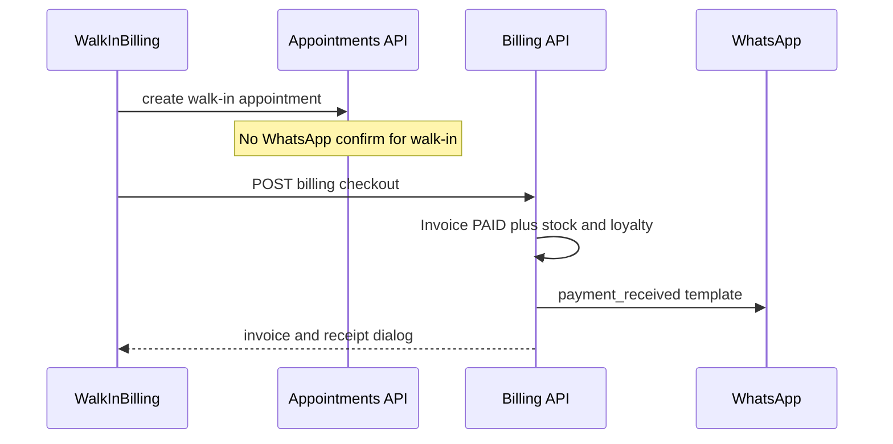
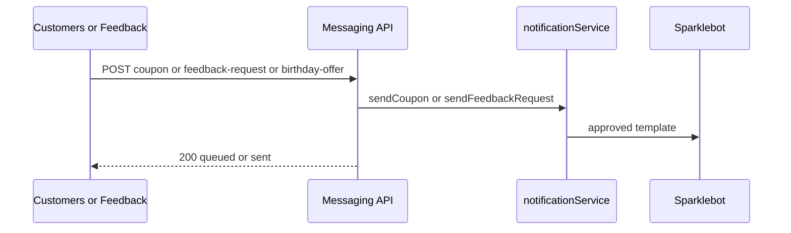

# BillVyapp — System Architecture (V1)

> **Product:** BillVyapp · Salon billing & operations platform  
> **Client:** The Starr Kuts  
> **Status:** Production V1 (final architecture for this release)  
> **Live:** https://billvyapp.com  
> **Last updated:** August 2026  
> **Repos:** `Frontend folder/` (Vite + React SPA) · `backend/` (Express + Prisma + MySQL)

This document describes the **as-built V1 architecture** — not a future target. It replaces earlier design notes that referenced Next.js / PostgreSQL.

---

## Table of contents

1. [High-level overview](#1-high-level-overview)
2. [System context](#2-system-context)
3. [Repository layout](#3-repository-layout)
4. [Frontend architecture](#4-frontend-architecture)
5. [Backend architecture](#5-backend-architecture)
6. [Database (Prisma / MySQL)](#6-database-prisma--mysql)
7. [Authentication & authorization](#7-authentication--authorization)
8. [Domain modules](#8-domain-modules)
9. [Integrations](#9-integrations)
10. [Key runtime flows](#10-key-runtime-flows)
11. [Infrastructure & deployment](#11-infrastructure--deployment)
12. [Configuration](#12-configuration)
13. [Observability & ops](#13-observability--ops)
14. [V1 scope & out of scope](#14-v1-scope--out-of-scope)
15. [Related docs](#15-related-docs)

---

## 1. High-level overview

BillVyapp is a **multi-tenant salon operations platform** for franchise salons. V1 delivers:

| Capability | Description |
|------------|-------------|
| **Walk-in & appointments** | Book, manage, and complete salon visits |
| **Billing / POS** | Checkout, GST, discounts, wallets, invoices, UPI QR |
| **Customers** | Profiles, history, memberships, loyalty, coupons |
| **Inventory** | Products, vendors, purchases, stock adjustments |
| **Finance** | Receipts, expenses (with delete approval), accounting views |
| **Dashboards** | Manager and admin KPIs |
| **Notifications** | In-app + WhatsApp (Sparklebot) |



**Stack (as built):**

| Layer | Technology |
|-------|------------|
| Frontend | React 18, TypeScript, Vite 6, Tailwind, Radix/ShadCN-style UI, Zustand, React Router 7, Axios, Framer Motion |
| Backend | Node.js, Express, TypeScript, Zod, Helmet, cookie-parser |
| ORM / DB | Prisma → **MySQL 8** (`relationMode = "prisma"`) |
| Auth | JWT access token + httpOnly refresh cookie |
| Queues | BullMQ on Redis / Memurai (WhatsApp); inline fallback without Redis |
| Messaging | Sparklebot WhatsApp Business templates |
| Hosting | Windows EC2 + Cloudflare (non-Docker prod path) |

---

## 2. System context



| Actor | Access |
|-------|--------|
| **Manager** | Day-to-day ops: appointments, walk-in billing, customers, inventory (role-gated routes) |
| **Admin** | Finance, expenses, higher-privilege salon controls |
| **Super-admin** | Franchises & platform users (`/super-admin`) |
| **Customer (indirect)** | Receives WhatsApp OTP / payment / coupon / feedback messages — no customer portal in V1 |

| External system | Role in V1 |
|-----------------|------------|
| **Sparklebot** | WhatsApp template sends (OTP, payment, coupons, feedback, appointments) |
| **MySQL** | System of record |
| **Memurai / Redis** | Cache + BullMQ job queue |
| **Cloudflare** | Public HTTPS edge for `billvyapp.com` |
| SMTP / SMS / Razorpay | Designed in; **credentials pending** for full go-live |

---

## 3. Repository layout

```
BillVyapp/
├── Frontend folder/          # Vite + React SPA
│   ├── src/app/              # Pages, routes, layout, contexts
│   ├── src/api/              # Axios API clients
│   ├── src/stores/           # Zustand (auth)
│   └── src/lib/              # Mappers, helpers
├── backend/
│   ├── prisma/               # schema.prisma, migrations, seed
│   ├── src/
│   │   ├── app.ts            # Express app + middleware
│   │   ├── server.ts         # Listen + Redis/BullMQ boot
│   │   ├── config/           # env, auth, whatsapp, redis, smtp…
│   │   ├── modules/          # Domain modules (see §8)
│   │   ├── queues/           # BullMQ connection, WhatsApp worker
│   │   ├── routes/           # apiRouter mount
│   │   └── utils/            # errors, logger, phone, responses
│   └── uploads/              # Local file storage (when enabled)
├── docs/                     # Status reports, WhatsApp/SMS templates
├── nginx/                    # Reference TLS / reverse-proxy configs
├── scripts/                  # EC2/cert helpers (Docker-oriented)
├── docker-compose.yml
├── docker-compose.prod.yml   # Reference container stack
├── ARCHITECTURE.md           # This file
└── README.md                 # GitHub landing page
```

**Git remotes**

| Remote | Repository | Typical use |
|--------|------------|-------------|
| `origin` | [MetaForge-IT/BillVyapp](https://github.com/MetaForge-IT/BillVyapp) | Development |
| `production` | [MetaForge-IT/BillVyapp-Production](https://github.com/MetaForge-IT/BillVyapp-Production) | EC2 deploy source |

Production HEAD tracks feature delivery: `rbac` → `fix-ui-db` → `admin-dashboard` → `fix-customers-db-uploads` → `whatapp-intigration` → `main`.

---

## 4. Frontend architecture

### 4.1 Runtime

- **Dev:** Vite on **:5173**, proxies `/api` → `http://localhost:4000`
- **Prod:** Built static assets served behind Cloudflare / host web server; API at `/api` (or `API_PUBLIC_URL`)

### 4.2 Layering



| Concern | Location |
|---------|----------|
| Routes & role gates | `Frontend folder/src/app/routes.tsx` |
| Auth session | `stores/authStore.ts` + `AuthContext` |
| Role helpers | `RoleContext` (from JWT claims) |
| HTTP | `lib/axios.ts` — access token header, silent refresh via cookie |
| Feature UI | `pages/*`, `pages/walkInBilling/*`, `pages/finance/*` |

### 4.3 Primary routes (V1)

| Path | Role | Module |
|------|------|--------|
| `/`, `/landing` | Public | Marketing / landing |
| `/login`, `/signup`, `/forgot-password`, `/reset-password` | Public | Auth |
| `/dashboard` | Authenticated | KPIs |
| `/appointments`, `/appointments/new`, `/walk-in` | Manager | Scheduling & POS |
| `/customers`, `/customers/new` | Authenticated | CRM |
| `/services` | Authenticated | Service catalog |
| `/inventory` | Authenticated | Stock |
| `/memberships` | Authenticated | Plans / tiers |
| `/finance` | Admin | Receipts / accounting |
| `/expenses` | Authenticated | Expenses + delete approval |
| `/feedback` | Authenticated | Feedback requests & inbox |
| `/notifications` | Authenticated | In-app notifications |
| `/super-admin/*` | Super-admin | Franchises / users |

Some legacy routes remain in the tree but redirect to dashboard (gated, not deleted) for a clean V1 surface.

### 4.4 Walk-in billing UX

Three-step POS (`Services` → `Customer` → `Bill`) with optional discounts/GST, payment method picker (cash / card / UPI QR / wallet / split), and post-payment receipt dialog (optional star feedback).

---

## 5. Backend architecture

### 5.1 Request pipeline



Entry points:

- `backend/src/app.ts` — Express application
- `backend/src/server.ts` — HTTP listen, Redis connect, BullMQ workers, graceful shutdown
- `backend/src/routes/index.ts` — mounts all module routers under `API_PREFIX` (default `/api`)

### 5.2 Module pattern

Each feature module typically includes:

```
modules/<name>/
  *.routes.ts
  *.controller.ts
  *.service.ts
  *.repository.ts
  *.validators.ts      # Zod
  *.constants.ts
  *.middleware.ts      # when needed
```

Cross-cutting services (no public CRUD routers): `email`, `sms`, `whatsapp`, `notifications`.

### 5.3 API surface (mounted routers)

| Mount | Module |
|-------|--------|
| `/api/auth` | Authentication, OTP, refresh, password reset |
| `/api/franchises`, `/api/my-franchise` | Multi-tenant franchise |
| `/api/customers` | CRM |
| `/api/dashboard` | Aggregated KPIs |
| `/api/notifications` | In-app notifications |
| `/api/messaging` | Staff-triggered WhatsApp (coupon, feedback, birthday) |
| `/api/appointments` | Scheduling |
| `/api/services`, `/api/service-categories` | Catalog |
| `/api/products`, `/api/product-categories`, `/api/vendors` | Inventory master data |
| `/api/stock-purchases`, `/api/stock-adjustments`, `/api/inventory` | Stock ops |
| `/api/billing` | Confirm-only, checkout, collect, refunds |
| `/api/feedback` | Ratings / feedback |
| `/api/plans`, `/api/coupons`, `/api/membership-tiers` | Memberships & promos |
| `/api/settings`, `/api/staff` | Salon config / staff |
| `/api/uploads` | File upload |
| `/api/search` | Global search |
| `/api/advances`, `/api/accounting` | Advances & finance ledger |
| `/api/service-product-links` | Service ↔ product consumption |
| `/api/health` | Health checks |

Default local API port: **4000** (production EC2 also uses 4000 in current `.env`). Compose reference images often expose **3000** internally.

---

## 6. Database (Prisma / MySQL)

**ORM:** Prisma  
**Engine:** MySQL 8  
**Migrations:** `backend/prisma/migrations/*` (deploy with `npx prisma migrate deploy`)

### 6.1 Domain model groups

| Domain | Models |
|--------|--------|
| **Tenancy** | `Franchise`, `Salon`, `BusinessHour` |
| **Identity** | `User`, `RefreshToken`, `PasswordResetToken`, `EmailVerificationToken`, `LoginOtpChallenge` |
| **Salon settings** | `SalonFinancialSettings`, `SalonNotificationSettings` |
| **CRM** | `Customer`, `CustomerPreference`, `Feedback` |
| **Loyalty / membership** | `MembershipTier`, `CustomerMembership`, `LoyaltyTransaction`, `WalletTransaction`, `SalonPlan`, `SalonPlanService`, `CustomerPlanEnrollment`, `Package`, `PackageService` |
| **Catalog** | `ServiceCategory`, `Service`, `ServiceProductLink` |
| **Inventory** | `ProductCategory`, `Vendor`, `Product`, `StockMovement`, `PurchaseOrder`, `PurchaseOrderItem` |
| **Scheduling** | `Appointment`, `AppointmentService` |
| **Billing** | `Invoice`, `InvoiceLineItem`, `Payment`, `Coupon`, `CouponRedemption`, `CustomerAdvance` |
| **Finance ops** | `Expense`, `BudgetPeriod`, `BudgetLine`, `DayClose` |
| **Comms** | `Notification` |



---

## 7. Authentication & authorization

### 7.1 Login sequence (V1 — WhatsApp OTP)



| Token | Storage | Purpose |
|-------|---------|---------|
| **Access JWT** | Memory / Zustand (persisted carefully) | `Authorization: Bearer` on API calls |
| **Refresh** | httpOnly cookie (`salon_refresh_token`) | Rotate access token via `/api/auth/refresh` |

### 7.2 Authorization

- `authenticate` — requires valid access token  
- `requireManager` / `authorize(roles…)` — role checks  
- Frontend mirrors with `<RequireAuth />` and `<RequireRole roles={[…]} />`

Primary V1 roles: **`manager`**, **`admin`**, **`super_admin`**.

`VERIFICATION_CHANNELS=whatsapp` drives OTP delivery. Email/SMS channels remain in config for later.

---

## 8. Domain modules

### 8.1 Backend module catalog

| Folder | Responsibility |
|--------|----------------|
| `auth` | Login, OTP, refresh, password reset, registration |
| `customers` | CRM CRUD, visits, memberships, redeem |
| `appointments` | Create/update/status; WhatsApp confirm for **scheduled** (not walk-in) |
| `billing` | `confirm-only`, `checkout`, `collect`, refunds; payment WhatsApp |
| `messaging` | Staff WhatsApp: coupon, feedback-request, birthday-offer |
| `whatsapp` | Sparklebot provider, templates, service orchestration |
| `notifications` | Channel orchestration (email / WhatsApp / SMS stubs) |
| `app-notifications` | In-app notification feed + generators |
| `dashboard` | Cached KPI aggregates |
| `services` / `service-categories` | Service catalog (+ bulk upload) |
| `products` / `product-categories` / `vendors` | Inventory masters |
| `inventory` / `stock-purchases` / `stock-adjustments` | Stock movements |
| `plans` / `membership-tiers` / `coupons` | Memberships & promos |
| `accounting` / `advances` | Finance ledger, advances, expense delete requests |
| `feedback` | Store / list / update feedback |
| `franchises` / `my-franchise` | Multi-salon tenancy |
| `uploads` | Local or S3 file storage |
| `search` | Cross-entity search |
| `settings` / `staff` | Salon settings & staff |
| `email` / `sms` | Provider adapters |

### 8.2 Frontend feature map

| UI area | Backend |
|---------|---------|
| Walk-In Billing | `appointments` + `billing/checkout` |
| Appointments | `appointments` |
| Customers (+ gift coupon) | `customers` + `messaging/whatsapp/coupon` |
| Feedback send request | `messaging/whatsapp/feedback-request` |
| Finance / Expenses | `billing`, `accounting` |
| Inventory | `products`, `vendors`, stock APIs |
| Dashboard | `dashboard` |
| Login OTP | `auth` + WhatsApp |

---

## 9. Integrations

### 9.1 WhatsApp (Sparklebot) — **production V1**

| Item | Value |
|------|--------|
| Provider | `WHATSAPP_PROVIDER=sparklebot` |
| API | `https://sparklebot.in/api/v1/{tenant}/messages/template` |
| Language | `en_IN` |
| Queue | BullMQ when `REDIS_URL` is set; else **inline send** |
| Templates | See `docs/whatsapp-templates/` (`starrkuts_*`) |

**Triggered messages**

| Event | Template (logical) |
|-------|-------------------|
| Login OTP | `starrkuts_login_otp` |
| Scheduled appointment confirm | `starrkuts_appt_confirm` |
| Payment received | `starrkuts_payment_received` |
| Coupon send | `starrkuts_coupon_send` |
| Feedback request | `starrkuts_feedback_request` |
| Birthday offer | `starrkuts_birthday_offer` |

Walk-in checkout intentionally **does not** send appointment confirmation — only **payment received**.

### 9.2 Redis / Memurai + BullMQ



- **Windows (local + EC2):** Memurai on `127.0.0.1:6379`  
- **Compose reference:** `redis://redis:6379`  
- Without Redis, WhatsApp still works (inline); queues disabled

### 9.3 Email / SMS / Payments

| Integration | V1 status |
|-------------|-----------|
| SMTP | Code ready — **credentials waiting** |
| SMS | Adapters present — **`SMS_ENABLED=false`**; waiting on provider |
| Razorpay | **Not integrated** — UPI QR + manual confirmation |
| Files | `FILES_STORAGE=local` or `s3` |

---

## 10. Key runtime flows

### 10.1 Walk-in payment



### 10.2 Staff coupon / feedback WhatsApp



---

## 11. Infrastructure & deployment

### 11.1 Production (live path)

| Component | Arrangement |
|-----------|-------------|
| Host | **Windows Server on EC2** (RDP) |
| App | Node processes (same as local `npm run` style) |
| DB | MySQL on host / LAN (`DATABASE_URL`) |
| Queue | **Memurai** Windows service · `REDIS_URL=redis://127.0.0.1:6379` |
| Edge | **Cloudflare** → https://billvyapp.com |
| Deploy | `git pull` from `production` remote → `npm install` → restart API/frontend |

### 11.2 Docker Compose (reference only)

`docker-compose.prod.yml` defines Redis, API, frontend, nginx TLS, Prometheus, Grafana for Linux/container deploys. **Current Starr Kuts production does not use this path.**

### 11.3 Local development

```text
Frontend folder/  →  npm run dev     →  :5173
backend/          →  npm run dev     →  :4000
Memurai           →  :6379           →  optional but recommended
MySQL             →  DATABASE_URL
```

---

## 12. Configuration

Grouped environment variables (see `backend/.env.prod.example`):

| Category | Keys (examples) |
|----------|-----------------|
| Runtime | `NODE_ENV`, `PORT`, `APP_NAME`, `LOG_LEVEL`, `API_PREFIX` |
| Database | `DATABASE_URL` |
| Auth | `JWT_ACCESS_*`, `JWT_REFRESH_*`, `REFRESH_COOKIE_*`, `LOGIN_OTP_*` |
| URLs | `CORS_ORIGIN`, `FRONTEND_URL`, `API_PUBLIC_URL` |
| Redis | `REDIS_URL`, `REDIS_DASHBOARD_TTL_SECONDS` |
| WhatsApp | `WHATSAPP_*`, `VERIFICATION_CHANNELS` |
| SMS | `SMS_ENABLED`, `SMS_PROVIDER`, … |
| SMTP | `SMTP_*` |
| Files | `FILES_STORAGE`, `LOCAL_UPLOAD_DIR`, `AWS_*` |
| Billing | `REFUND_APPROVAL_PIN` |
| Observability | `SENTRY_DSN`, `SENTRY_ENVIRONMENT` |

Frontend build: `VITE_API_URL`, `VITE_SENTRY_DSN`.

**Never commit** real `.env` files or access tokens.

---

## 13. Observability & ops

| Concern | Mechanism |
|---------|-----------|
| Structured logs | Backend logger (JSON in production) |
| Health | `/api/health` (includes Redis status when configured) |
| Errors | Central `errorHandler`; optional Sentry |
| Metrics | `prom-client` middleware; optional Prometheus/Grafana in compose |
| Queues | BullMQ workers started from `server.ts` when Redis connects |

---

## 14. V1 scope & out of scope

### In scope (delivered)

- Manager / Admin / Super-admin app surfaces  
- Appointments + walk-in POS  
- Customers, services, inventory, memberships  
- Billing with GST/discounts/wallets/UPI QR  
- Expenses with manager delete-request / admin approval  
- In-app notifications  
- WhatsApp via Sparklebot (OTP, payment, coupons, feedback, scheduled appt confirm)  
- Production deployment on Windows EC2 + Cloudflare  

### Explicitly deferred / waiting

| Item | Notes |
|------|-------|
| SMTP email | Verification, reset, email receipts |
| SMS | Alternate OTP / marketing SMS |
| Razorpay | Online gateway; UPI QR remains |
| Customer self-service portal | Not in V1 |
| Full marketing / AI / CEO suites | Routes removed or gated |

---

## 15. Related docs

| Document | Purpose |
|----------|---------|
| [README.md](./README.md) | Project landing (GitHub main page) |
| [docs/BillVyapp-Project-Status-Report-2026-08-07.md](./docs/BillVyapp-Project-Status-Report-2026-08-07.md) | Phase status report |
| [docs/whatsapp-templates/](./docs/whatsapp-templates/) | WhatsApp template catalog & CSV |
| [DATABASE_DESIGN_V1.md](./DATABASE_DESIGN_V1.md) | Earlier data design notes (verify against live `schema.prisma`) |
| `backend/.env.prod.example` | Production env template |
| `docker-compose.prod.yml` | Optional container architecture |

---

## Document control

| Version | Date | Notes |
|---------|------|-------|
| V1 final | Aug 2026 | As-built architecture: Vite/React + Express + MySQL + Sparklebot + Memurai/BullMQ on Windows EC2 |

For questions on module ownership or extendability, start from `backend/src/modules/` and `Frontend folder/src/app/routes.tsx`.
