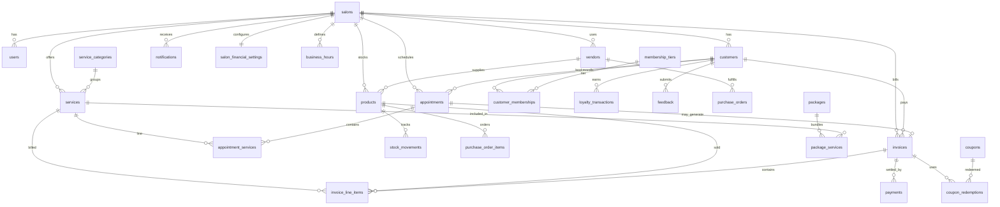

# Salon Management System — Database Design (Version 1)

> **Document type:** Relational schema design (review only)  
> **Version:** 1.0  
> **Date:** 2026-07-01  
> **Status:** Approved for implementation planning  

---

## 1. Design goals

| Goal | Approach |
|------|----------|
| **V1 scope** | Single salon, single manager, no employees, no multi-branch UI |
| **Normalization** | 3NF where practical; snapshot fields only on immutable billing rows |
| **Future scale** | `salon_id` on tenant-scoped tables; nullable `branch_id` reserved on key entities |
| **Frontend alignment** | Shapes match existing UI modules (Customers, Appointments, Finance, Inventory, etc.) |
| **Auditability** | `created_at` / `updated_at` on all core tables; status history where state changes matter |

### V1 constraints (explicit)

- Exactly **one** row in `salons` (seeded at install).
- Exactly **one** `users` row with `role = manager`.
- **No** `employees`, `roles`, or `permissions` tables in V1.
- Staff on appointments stored as **free-text** (`staff_name`), not FK.
- `branch_id` columns exist but remain **NULL** in V1.

---

## 2. Entity relationship overview

---

## 3. Table inventory (32 tables)

| # | Module | Table | Purpose |
|---|--------|-------|---------|
| 1 | Core | `salons` | Salon identity & profile (tenant root) |
| 2 | Core | `business_hours` | Weekly operating hours |
| 3 | Auth | `users` | Manager login account (V1: single row) |
| 4 | Auth | `refresh_tokens` | JWT refresh token store |
| 5 | Auth | `password_reset_tokens` | Forgot-password flow tokens |
| 6 | Settings | `salon_financial_settings` | GST, loyalty, discount rules |
| 7 | Settings | `salon_notification_settings` | Alert & channel preferences |
| 8 | Customers | `customers` | CRM master record |
| 9 | Customers | `customer_preferences` | Favorites, allergies, notes |
| 10 | Memberships | `membership_tiers` | Tier catalog (Basic, Silver, Gold, Platinum) |
| 11 | Memberships | `customer_memberships` | Customer tier enrollment history |
| 12 | Memberships | `loyalty_transactions` | Points earn/redeem ledger |
| 13 | Services | `service_categories` | Service grouping |
| 14 | Services | `services` | Bookable salon services |
| 15 | Services | `packages` | Bundled service packages |
| 16 | Services | `package_services` | Package ↔ service (M:N) |
| 17 | Products | `products` | Retail & consumable inventory SKUs |
| 18 | Inventory | `stock_movements` | Stock in/out audit log |
| 19 | Inventory | `purchase_orders` | Vendor purchase orders |
| 20 | Inventory | `purchase_order_items` | PO line items |
| 21 | Vendors | `vendors` | Supplier master |
| 22 | Appointments | `appointments` | Booking & walk-in records |
| 23 | Appointments | `appointment_services` | Services per appointment |
| 24 | Billing | `invoices` | Bills / receipts header |
| 25 | Billing | `invoice_line_items` | Bill line items (services, products, packages) |
| 26 | Billing | `payments` | Payment settlements per invoice |
| 27 | Billing | `coupons` | Discount coupon definitions |
| 28 | Billing | `coupon_redemptions` | Coupon usage per invoice |
| 29 | Notifications | `notifications` | In-app notification feed |
| 30 | Feedback | `feedback` | Customer ratings & comments |
| 31 | Auth | `user_sessions` | Optional active session tracking |
| 32 | Core | `schema_migrations` | *(Prisma-managed; not hand-authored)* |

---

## 4. Shared conventions

### Primary keys
- **UUID** (`uuid`, PK) for all tables — safe for distributed IDs and API exposure.
- Exception: use `serial` only if team prefers integers; UUID recommended.

### Standard columns (all business tables)
| Column | Type | Notes |
|--------|------|-------|
| `id` | UUID | PK |
| `salon_id` | UUID | FK → `salons.id` (tenant scope) |
| `branch_id` | UUID NULL | FK → future `branches.id`; **NULL in V1** |
| `created_at` | TIMESTAMPTZ | Default `now()` |
| `updated_at` | TIMESTAMPTZ | Auto-updated |

### Soft delete
- `deleted_at TIMESTAMPTZ NULL` on: `customers`, `services`, `products`, `vendors`, `coupons`.

### Enumerations (PostgreSQL ENUM or CHECK)
| Enum | Values |
|------|--------|
| `user_role` | `manager` *(V1 only; extend later)* |
| `gender` | `male`, `female`, `other` |
| `customer_status` | `active`, `inactive` |
| `appointment_status` | `pending`, `confirmed`, `in_progress`, `completed`, `cancelled`, `no_show` |
| `appointment_type` | `appointment`, `walk_in` |
| `stock_movement_type` | `service_used`, `retail_sale`, `manual_adjustment`, `restock`, `bulk_import`, `purchase_received` |
| `purchase_order_status` | `pending`, `shipped`, `delivered`, `cancelled` |
| `invoice_status` | `draft`, `paid`, `partially_paid`, `void`, `refunded` |
| `invoice_source` | `pos`, `appointment` |
| `line_item_type` | `service`, `product`, `package` |
| `payment_method` | `cash`, `card`, `upi`, `wallet` |
| `coupon_type` | `percentage`, `flat` |
| `coupon_status` | `active`, `expired`, `disabled` |
| `notification_category` | `warning`, `success`, `payment`, `appointment`, `inventory`, `system` |
| `feedback_source` | `google`, `app`, `sms` |
| `feedback_sentiment` | `positive`, `neutral`, `negative` |
| `membership_status` | `active`, `expired`, `cancelled` |
| `loyalty_tx_type` | `earn`, `redeem`, `adjust`, `expire` |

---

## 5. Module table definitions

---

### 5.1 Core — `salons`

**Purpose:** Root tenant record. V1 has exactly one row representing the salon location.

| Column | Type | Constraints | Description |
|--------|------|-------------|-------------|
| `id` | UUID | PK | Salon identifier |
| `name` | VARCHAR(200) | NOT NULL | Display name |
| `tagline` | VARCHAR(500) | NULL | Marketing tagline |
| `address` | TEXT | NULL | Street address |
| `city` | VARCHAR(100) | NULL | City |
| `state` | VARCHAR(100) | NULL | State |
| `pincode` | VARCHAR(20) | NULL | Postal code |
| `phone` | VARCHAR(20) | NOT NULL | Primary phone |
| `email` | VARCHAR(255) | NOT NULL | Contact email |
| `website` | VARCHAR(255) | NULL | Website URL |
| `gstin` | VARCHAR(15) | NULL | Tax registration |
| `logo_url` | VARCHAR(500) | NULL | S3 URL (future) |
| `timezone` | VARCHAR(50) | NOT NULL DEFAULT `Asia/Kolkata` | IANA timezone |
| `currency` | CHAR(3) | NOT NULL DEFAULT `INR` | ISO currency |
| `is_active` | BOOLEAN | NOT NULL DEFAULT TRUE | |
| `created_at` | TIMESTAMPTZ | NOT NULL | |
| `updated_at` | TIMESTAMPTZ | NOT NULL | |

**Relationships:** One-to-Many → all tenant-scoped tables.

**Indexes:** `UNIQUE (email)` where business rules require unique salon email.

---

### 5.2 Core — `business_hours`

**Purpose:** Operating hours per day of week (matches `SettingsContext` `WeekHours`).

| Column | Type | Constraints | Description |
|--------|------|-------------|-------------|
| `id` | UUID | PK | |
| `salon_id` | UUID | FK → salons, NOT NULL | |
| `day_of_week` | SMALLINT | NOT NULL, CHECK 0–6 | 0=Sunday … 6=Saturday |
| `open_time` | TIME | NULL | NULL if closed |
| `close_time` | TIME | NULL | |
| `is_closed` | BOOLEAN | NOT NULL DEFAULT FALSE | |
| `created_at` | TIMESTAMPTZ | NOT NULL | |
| `updated_at` | TIMESTAMPTZ | NOT NULL | |

**Relationships:** Many-to-One → `salons`.

**Indexes:** `UNIQUE (salon_id, day_of_week)`.

---

### 5.3 Authentication — `users`

**Purpose:** Login accounts. V1: single manager row only.

| Column | Type | Constraints | Description |
|--------|------|-------------|-------------|
| `id` | UUID | PK | |
| `salon_id` | UUID | FK → salons, NOT NULL | Tenant scope |
| `email` | VARCHAR(255) | NOT NULL | Login email |
| `password_hash` | VARCHAR(255) | NOT NULL | bcrypt/argon2 hash |
| `full_name` | VARCHAR(200) | NOT NULL | |
| `role` | user_role | NOT NULL DEFAULT `manager` | V1: always `manager` |
| `phone` | VARCHAR(20) | NULL | |
| `avatar_url` | VARCHAR(500) | NULL | |
| `is_active` | BOOLEAN | NOT NULL DEFAULT TRUE | |
| `email_verified_at` | TIMESTAMPTZ | NULL | |
| `last_login_at` | TIMESTAMPTZ | NULL | |
| `created_at` | TIMESTAMPTZ | NOT NULL | |
| `updated_at` | TIMESTAMPTZ | NOT NULL | |

**Relationships:** Many-to-One → `salons`; One-to-Many → `refresh_tokens`, `password_reset_tokens`.

**Indexes:**
- `UNIQUE (salon_id, email)`
- `INDEX (email)` for login lookup

---

### 5.4 Authentication — `refresh_tokens`

**Purpose:** Store hashed refresh tokens for JWT rotation.

| Column | Type | Constraints | Description |
|--------|------|-------------|-------------|
| `id` | UUID | PK | |
| `user_id` | UUID | FK → users, NOT NULL | |
| `token_hash` | VARCHAR(255) | NOT NULL | Hashed token |
| `expires_at` | TIMESTAMPTZ | NOT NULL | |
| `revoked_at` | TIMESTAMPTZ | NULL | |
| `created_at` | TIMESTAMPTZ | NOT NULL | |
| `user_agent` | VARCHAR(500) | NULL | |
| `ip_address` | INET | NULL | |

**Relationships:** Many-to-One → `users`.

**Indexes:** `INDEX (user_id)`, `INDEX (expires_at)` for cleanup job.

---

### 5.5 Authentication — `password_reset_tokens`

**Purpose:** One-time tokens for forgot-password flow.

| Column | Type | Constraints | Description |
|--------|------|-------------|-------------|
| `id` | UUID | PK | |
| `user_id` | UUID | FK → users, NOT NULL | |
| `token_hash` | VARCHAR(255) | NOT NULL | |
| `expires_at` | TIMESTAMPTZ | NOT NULL | |
| `used_at` | TIMESTAMPTZ | NULL | |
| `created_at` | TIMESTAMPTZ | NOT NULL | |

**Relationships:** Many-to-One → `users`.

**Indexes:** `INDEX (user_id)`, `INDEX (expires_at)`.

---

### 5.6 Settings — `salon_financial_settings`

**Purpose:** GST, loyalty, and billing rules (one row per salon).

| Column | Type | Constraints | Description |
|--------|------|-------------|-------------|
| `id` | UUID | PK | |
| `salon_id` | UUID | FK → salons, UNIQUE, NOT NULL | One per salon |
| `gst_enabled` | BOOLEAN | NOT NULL DEFAULT TRUE | |
| `default_gst_rate` | DECIMAL(5,2) | NOT NULL DEFAULT 18.00 | % |
| `loyalty_points_per_rupee` | DECIMAL(10,4) | NOT NULL DEFAULT 0.10 | e.g. 1 pt / ₹10 |
| `loyalty_rupee_per_point` | DECIMAL(10,2) | NOT NULL DEFAULT 0.50 | Redemption value |
| `max_discount_percent` | DECIMAL(5,2) | NOT NULL DEFAULT 50.00 | Manager cap V1 |
| `round_off_mode` | VARCHAR(10) | NOT NULL DEFAULT `none` | none, 1, 5, 10 |
| `receipt_prefix` | VARCHAR(10) | NOT NULL DEFAULT `RCP` | |
| `next_receipt_sequence` | INTEGER | NOT NULL DEFAULT 1 | Atomic counter |
| `created_at` | TIMESTAMPTZ | NOT NULL | |
| `updated_at` | TIMESTAMPTZ | NOT NULL | |

**Relationships:** One-to-One → `salons`.

---

### 5.7 Settings — `salon_notification_settings`

**Purpose:** Alert thresholds and delivery channel toggles.

| Column | Type | Constraints | Description |
|--------|------|-------------|-------------|
| `id` | UUID | PK | |
| `salon_id` | UUID | FK → salons, UNIQUE, NOT NULL | |
| `low_stock_alerts` | BOOLEAN | NOT NULL DEFAULT TRUE | |
| `low_stock_threshold_qty` | INTEGER | NOT NULL DEFAULT 10 | |
| `appointment_reminder_enabled` | BOOLEAN | NOT NULL DEFAULT TRUE | |
| `reminder_minutes_before` | INTEGER | NOT NULL DEFAULT 60 | |
| `daily_summary_enabled` | BOOLEAN | NOT NULL DEFAULT FALSE | |
| `daily_summary_time` | TIME | NOT NULL DEFAULT `20:00` | |
| `payment_alerts` | BOOLEAN | NOT NULL DEFAULT TRUE | |
| `sms_enabled` | BOOLEAN | NOT NULL DEFAULT FALSE | |
| `whatsapp_enabled` | BOOLEAN | NOT NULL DEFAULT FALSE | |
| `email_enabled` | BOOLEAN | NOT NULL DEFAULT TRUE | |
| `created_at` | TIMESTAMPTZ | NOT NULL | |
| `updated_at` | TIMESTAMPTZ | NOT NULL | |

**Relationships:** One-to-One → `salons`.

---

### 5.8 Customers — `customers`

**Purpose:** CRM master — aligns with frontend `Customer` interface.

| Column | Type | Constraints | Description |
|--------|------|-------------|-------------|
| `id` | UUID | PK | |
| `salon_id` | UUID | FK → salons, NOT NULL | |
| `branch_id` | UUID | NULL | Future multi-branch |
| `full_name` | VARCHAR(200) | NOT NULL | |
| `phone` | VARCHAR(20) | NOT NULL | E.164 or local format |
| `email` | VARCHAR(255) | NULL | |
| `gender` | gender | NULL | |
| `date_of_birth` | DATE | NULL | Birthday campaigns |
| `address` | TEXT | NULL | |
| `gstin` | VARCHAR(15) | NULL | B2B customers |
| `status` | customer_status | NOT NULL DEFAULT `active` | |
| `loyalty_points` | INTEGER | NOT NULL DEFAULT 0 | Cached balance |
| `total_visits` | INTEGER | NOT NULL DEFAULT 0 | Denormalized counter |
| `total_spend` | DECIMAL(12,2) | NOT NULL DEFAULT 0 | Denormalized ₹ |
| `avg_satisfaction` | DECIMAL(3,2) | NULL | Rolling average rating |
| `last_visit_at` | TIMESTAMPTZ | NULL | |
| `joined_at` | DATE | NOT NULL | Member since |
| `current_tier_id` | UUID | FK → membership_tiers, NULL | Active tier shortcut |
| `deleted_at` | TIMESTAMPTZ | NULL | Soft delete |
| `created_at` | TIMESTAMPTZ | NOT NULL | |
| `updated_at` | TIMESTAMPTZ | NOT NULL | |

**Relationships:**
- Many-to-One → `salons`, `membership_tiers` (current tier)
- One-to-One → `customer_preferences`
- One-to-Many → `appointments`, `invoices`, `feedback`, `customer_memberships`, `loyalty_transactions`

**Indexes:**
- `UNIQUE (salon_id, phone)` — primary lookup
- `INDEX (salon_id, email)`
- `INDEX (salon_id, status)`
- `INDEX (salon_id, last_visit_at)`
- `INDEX (salon_id, date_of_birth)` — birthday campaigns

---

### 5.9 Customers — `customer_preferences`

**Purpose:** Favorites, preferred staff (text), allergies/notes — matches Preferences tab.

| Column | Type | Constraints | Description |
|--------|------|-------------|-------------|
| `id` | UUID | PK | |
| `customer_id` | UUID | FK → customers, UNIQUE, NOT NULL | One per customer |
| `favorite_service_id` | UUID | FK → services, NULL | |
| `preferred_staff_name` | VARCHAR(200) | NULL | Free text (no employees V1) |
| `notes` | TEXT | NULL | Allergies, preferences |
| `created_at` | TIMESTAMPTZ | NOT NULL | |
| `updated_at` | TIMESTAMPTZ | NOT NULL | |

**Relationships:**
- One-to-One → `customers`
- Many-to-One → `services` (optional favorite)

---

### 5.10 Memberships — `membership_tiers`

**Purpose:** Tier catalog (Basic, Silver, Gold, Platinum).

| Column | Type | Constraints | Description |
|--------|------|-------------|-------------|
| `id` | UUID | PK | |
| `salon_id` | UUID | FK → salons, NOT NULL | |
| `name` | VARCHAR(50) | NOT NULL | e.g. Platinum |
| `slug` | VARCHAR(50) | NOT NULL | e.g. platinum |
| `rank` | SMALLINT | NOT NULL | Sort order 1–4 |
| `price` | DECIMAL(10,2) | NOT NULL DEFAULT 0 | Annual price |
| `duration_months` | SMALLINT | NOT NULL DEFAULT 12 | |
| `discount_percent` | DECIMAL(5,2) | NOT NULL DEFAULT 0 | |
| `points_multiplier` | DECIMAL(4,2) | NOT NULL DEFAULT 1.0 | |
| `benefits` | JSONB | NULL | Array of benefit strings |
| `is_active` | BOOLEAN | NOT NULL DEFAULT TRUE | |
| `created_at` | TIMESTAMPTZ | NOT NULL | |
| `updated_at` | TIMESTAMPTZ | NOT NULL | |

**Relationships:** One-to-Many → `customer_memberships`; referenced by `customers.current_tier_id`.

**Indexes:** `UNIQUE (salon_id, slug)`.

---

### 5.11 Memberships — `customer_memberships`

**Purpose:** Enrollment history when customer upgrades/downgrades tier.

| Column | Type | Constraints | Description |
|--------|------|-------------|-------------|
| `id` | UUID | PK | |
| `salon_id` | UUID | FK → salons, NOT NULL | |
| `customer_id` | UUID | FK → customers, NOT NULL | |
| `tier_id` | UUID | FK → membership_tiers, NOT NULL | |
| `start_date` | DATE | NOT NULL | |
| `end_date` | DATE | NULL | |
| `status` | membership_status | NOT NULL DEFAULT `active` | |
| `amount_paid` | DECIMAL(10,2) | NOT NULL DEFAULT 0 | |
| `created_at` | TIMESTAMPTZ | NOT NULL | |
| `updated_at` | TIMESTAMPTZ | NOT NULL | |

**Relationships:** Many-to-One → `customers`, `membership_tiers`.

**Indexes:** `INDEX (customer_id, status)`, `INDEX (salon_id, end_date)`.

---

### 5.12 Memberships — `loyalty_transactions`

**Purpose:** Immutable points ledger (earn on bill, redeem, manual adjust).

| Column | Type | Constraints | Description |
|--------|------|-------------|-------------|
| `id` | UUID | PK | |
| `salon_id` | UUID | FK → salons, NOT NULL | |
| `customer_id` | UUID | FK → customers, NOT NULL | |
| `invoice_id` | UUID | FK → invoices, NULL | Source bill if applicable |
| `type` | loyalty_tx_type | NOT NULL | |
| `points` | INTEGER | NOT NULL | Positive earn, negative redeem |
| `balance_after` | INTEGER | NOT NULL | Running balance snapshot |
| `note` | VARCHAR(500) | NULL | |
| `created_at` | TIMESTAMPTZ | NOT NULL | |

**Relationships:** Many-to-One → `customers`, `invoices` (optional).

**Indexes:** `INDEX (customer_id, created_at DESC)`.

---

### 5.13 Services — `service_categories`

**Purpose:** Group services (Hair Care, Spa, Men's Services, etc.).

| Column | Type | Constraints | Description |
|--------|------|-------------|-------------|
| `id` | UUID | PK | |
| `salon_id` | UUID | FK → salons, NOT NULL | |
| `name` | VARCHAR(100) | NOT NULL | |
| `sort_order` | SMALLINT | NOT NULL DEFAULT 0 | |
| `is_active` | BOOLEAN | NOT NULL DEFAULT TRUE | |
| `created_at` | TIMESTAMPTZ | NOT NULL | |
| `updated_at` | TIMESTAMPTZ | NOT NULL | |

**Indexes:** `UNIQUE (salon_id, name)`.

---

### 5.14 Services — `services`

**Purpose:** Bookable salon services — aligns with `SERVICE_CATALOG`.

| Column | Type | Constraints | Description |
|--------|------|-------------|-------------|
| `id` | UUID | PK | |
| `salon_id` | UUID | FK → salons, NOT NULL | |
| `category_id` | UUID | FK → service_categories, NOT NULL | |
| `name` | VARCHAR(200) | NOT NULL | |
| `description` | TEXT | NULL | |
| `price` | DECIMAL(10,2) | NOT NULL | Standard price |
| `member_price` | DECIMAL(10,2) | NULL | Tier-discounted price |
| `duration_minutes` | SMALLINT | NOT NULL DEFAULT 30 | |
| `gender_tag` | VARCHAR(20) | NULL | male, female, unisex |
| `is_active` | BOOLEAN | NOT NULL DEFAULT TRUE | |
| `deleted_at` | TIMESTAMPTZ | NULL | |
| `created_at` | TIMESTAMPTZ | NOT NULL | |
| `updated_at` | TIMESTAMPTZ | NOT NULL | |

**Relationships:** Many-to-One → `service_categories`; Many-to-Many → `packages` via `package_services`.

**Indexes:**
- `INDEX (salon_id, category_id)`
- `INDEX (salon_id, is_active)`
- `INDEX (salon_id, name)` — search

---

### 5.15 Services — `packages`

**Purpose:** Bundled offerings (Bridal Package, etc.).

| Column | Type | Constraints | Description |
|--------|------|-------------|-------------|
| `id` | UUID | PK | |
| `salon_id` | UUID | FK → salons, NOT NULL | |
| `name` | VARCHAR(200) | NOT NULL | |
| `description` | TEXT | NULL | |
| `price` | DECIMAL(10,2) | NOT NULL | |
| `member_price` | DECIMAL(10,2) | NULL | |
| `duration_minutes` | SMALLINT | NOT NULL | Total estimated |
| `is_active` | BOOLEAN | NOT NULL DEFAULT TRUE | |
| `created_at` | TIMESTAMPTZ | NOT NULL | |
| `updated_at` | TIMESTAMPTZ | NOT NULL | |

**Relationships:** Many-to-Many → `services` via `package_services`.

---

### 5.16 Services — `package_services` *(junction)*

**Purpose:** Many-to-Many — which services are included in a package.

| Column | Type | Constraints | Description |
|--------|------|-------------|-------------|
| `package_id` | UUID | PK, FK → packages | |
| `service_id` | UUID | PK, FK → services | |
| `quantity` | SMALLINT | NOT NULL DEFAULT 1 | |

**Relationships:** Many-to-Many bridge between `packages` and `services`.

**Indexes:** Composite PK `(package_id, service_id)`.

---

### 5.17 Products — `products`

**Purpose:** Inventory SKUs (retail + consumables) — aligns with `ProductsContext`.

| Column | Type | Constraints | Description |
|--------|------|-------------|-------------|
| `id` | UUID | PK | |
| `salon_id` | UUID | FK → salons, NOT NULL | |
| `vendor_id` | UUID | FK → vendors, NULL | Primary supplier |
| `sku` | VARCHAR(50) | NOT NULL | |
| `name` | VARCHAR(200) | NOT NULL | |
| `category` | VARCHAR(100) | NOT NULL | Hair Care, Color, etc. |
| `brand` | VARCHAR(100) | NULL | |
| `stock_qty` | INTEGER | NOT NULL DEFAULT 0 | Current on-hand |
| `min_stock_qty` | INTEGER | NOT NULL DEFAULT 0 | Reorder threshold |
| `retail_price` | DECIMAL(10,2) | NOT NULL | |
| `cost_price` | DECIMAL(10,2) | NOT NULL | |
| `status` | VARCHAR(20) | NOT NULL DEFAULT `ok` | ok, low, critical, out *(computed or cached)* |
| `last_restocked_at` | TIMESTAMPTZ | NULL | |
| `is_active` | BOOLEAN | NOT NULL DEFAULT TRUE | |
| `deleted_at` | TIMESTAMPTZ | NULL | |
| `created_at` | TIMESTAMPTZ | NOT NULL | |
| `updated_at` | TIMESTAMPTZ | NOT NULL | |

**Relationships:** Many-to-One → `vendors`; One-to-Many → `stock_movements`, `purchase_order_items`.

**Indexes:**
- `UNIQUE (salon_id, sku)`
- `INDEX (salon_id, category)`
- `INDEX (salon_id, stock_qty)` — low-stock queries

---

### 5.18 Inventory — `stock_movements`

**Purpose:** Audit log for every stock change — aligns with `StockLog`.

| Column | Type | Constraints | Description |
|--------|------|-------------|-------------|
| `id` | UUID | PK | |
| `salon_id` | UUID | FK → salons, NOT NULL | |
| `product_id` | UUID | FK → products, NOT NULL | |
| `movement_type` | stock_movement_type | NOT NULL | |
| `qty_change` | INTEGER | NOT NULL | Signed (+ in, − out) |
| `stock_before` | INTEGER | NOT NULL | |
| `stock_after` | INTEGER | NOT NULL | |
| `reference_type` | VARCHAR(50) | NULL | appointment, invoice, po |
| `reference_id` | UUID | NULL | Polymorphic FK |
| `note` | VARCHAR(500) | NULL | |
| `created_at` | TIMESTAMPTZ | NOT NULL | |

**Relationships:** Many-to-One → `products`.

**Indexes:** `INDEX (product_id, created_at DESC)`, `INDEX (salon_id, movement_type)`.

---

### 5.19 Vendors — `vendors`

**Purpose:** Supplier master — aligns with Vendors tab in Inventory.

| Column | Type | Constraints | Description |
|--------|------|-------------|-------------|
| `id` | UUID | PK | |
| `salon_id` | UUID | FK → salons, NOT NULL | |
| `name` | VARCHAR(200) | NOT NULL | |
| `contact_person` | VARCHAR(200) | NULL | |
| `phone` | VARCHAR(20) | NULL | |
| `email` | VARCHAR(255) | NULL | |
| `address` | TEXT | NULL | |
| `gstin` | VARCHAR(15) | NULL | |
| `payment_terms` | VARCHAR(100) | NULL | Net 30, etc. |
| `is_active` | BOOLEAN | NOT NULL DEFAULT TRUE | |
| `deleted_at` | TIMESTAMPTZ | NULL | |
| `created_at` | TIMESTAMPTZ | NOT NULL | |
| `updated_at` | TIMESTAMPTZ | NOT NULL | |

**Relationships:** One-to-Many → `products`, `purchase_orders`.

**Indexes:** `UNIQUE (salon_id, name)`.

---

### 5.20 Inventory — `purchase_orders`

**Purpose:** Orders placed to vendors.

| Column | Type | Constraints | Description |
|--------|------|-------------|-------------|
| `id` | UUID | PK | |
| `salon_id` | UUID | FK → salons, NOT NULL | |
| `vendor_id` | UUID | FK → vendors, NOT NULL | |
| `po_number` | VARCHAR(30) | NOT NULL | e.g. PO-2024 |
| `status` | purchase_order_status | NOT NULL DEFAULT `pending` | |
| `order_date` | DATE | NOT NULL | |
| `expected_date` | DATE | NULL | |
| `delivered_date` | DATE | NULL | |
| `total_amount` | DECIMAL(12,2) | NOT NULL DEFAULT 0 | |
| `notes` | TEXT | NULL | |
| `created_at` | TIMESTAMPTZ | NOT NULL | |
| `updated_at` | TIMESTAMPTZ | NOT NULL | |

**Relationships:** Many-to-One → `vendors`; One-to-Many → `purchase_order_items`.

**Indexes:** `UNIQUE (salon_id, po_number)`, `INDEX (salon_id, status)`.

---

### 5.21 Inventory — `purchase_order_items`

**Purpose:** Line items on a purchase order.

| Column | Type | Constraints | Description |
|--------|------|-------------|-------------|
| `id` | UUID | PK | |
| `purchase_order_id` | UUID | FK → purchase_orders, NOT NULL | |
| `product_id` | UUID | FK → products, NOT NULL | |
| `quantity_ordered` | INTEGER | NOT NULL | |
| `quantity_received` | INTEGER | NOT NULL DEFAULT 0 | |
| `unit_cost` | DECIMAL(10,2) | NOT NULL | |
| `line_total` | DECIMAL(12,2) | NOT NULL | |
| `created_at` | TIMESTAMPTZ | NOT NULL | |

**Relationships:** Many-to-One → `purchase_orders`, `products`.

**Indexes:** `INDEX (purchase_order_id)`.

---

### 5.22 Appointments — `appointments`

**Purpose:** Scheduled and walk-in visits — aligns with `AppointmentContext`.

| Column | Type | Constraints | Description |
|--------|------|-------------|-------------|
| `id` | UUID | PK | |
| `salon_id` | UUID | FK → salons, NOT NULL | |
| `branch_id` | UUID | NULL | Future |
| `customer_id` | UUID | FK → customers, NOT NULL | |
| `appointment_type` | appointment_type | NOT NULL | |
| `status` | appointment_status | NOT NULL DEFAULT `pending` | |
| `scheduled_date` | DATE | NOT NULL | |
| `scheduled_time` | TIME | NOT NULL | |
| `duration_minutes` | SMALLINT | NOT NULL | |
| `staff_name` | VARCHAR(200) | NULL | Free text (no employees V1) |
| `notes` | TEXT | NULL | |
| `invoice_id` | UUID | FK → invoices, NULL | Linked bill when completed |
| `cancelled_at` | TIMESTAMPTZ | NULL | |
| `completed_at` | TIMESTAMPTZ | NULL | |
| `created_at` | TIMESTAMPTZ | NOT NULL | |
| `updated_at` | TIMESTAMPTZ | NOT NULL | |

**Relationships:**
- Many-to-One → `customers`, `invoices` (optional)
- One-to-Many → `appointment_services`

**Indexes:**
- `INDEX (salon_id, scheduled_date, scheduled_time)` — calendar view
- `INDEX (salon_id, status)`
- `INDEX (customer_id)`

---

### 5.23 Appointments — `appointment_services`

**Purpose:** Services attached to an appointment (replaces comma-joined string).

| Column | Type | Constraints | Description |
|--------|------|-------------|-------------|
| `id` | UUID | PK | |
| `appointment_id` | UUID | FK → appointments, NOT NULL | |
| `service_id` | UUID | FK → services, NULL | NULL if ad-hoc name |
| `package_id` | UUID | FK → packages, NULL | |
| `item_name` | VARCHAR(200) | NOT NULL | Snapshot name |
| `price` | DECIMAL(10,2) | NOT NULL | Price at booking |
| `duration_minutes` | SMALLINT | NOT NULL | |
| `sort_order` | SMALLINT | NOT NULL DEFAULT 0 | |
| `created_at` | TIMESTAMPTZ | NOT NULL | |

**Relationships:** Many-to-One → `appointments`, `services`, `packages`.

**Indexes:** `INDEX (appointment_id)`.

---

### 5.24 Billing — `invoices`

**Purpose:** Receipts / bills header — aligns with `ReceiptRecord`.

| Column | Type | Constraints | Description |
|--------|------|-------------|-------------|
| `id` | UUID | PK | |
| `salon_id` | UUID | FK → salons, NOT NULL | |
| `customer_id` | UUID | FK → customers, NOT NULL | |
| `appointment_id` | UUID | FK → appointments, NULL | |
| `receipt_number` | VARCHAR(30) | NOT NULL | e.g. RCP-2847 |
| `invoice_date` | DATE | NOT NULL | |
| `invoice_time` | TIME | NOT NULL | |
| `source` | invoice_source | NOT NULL | pos, appointment |
| `status` | invoice_status | NOT NULL DEFAULT `paid` | |
| `subtotal` | DECIMAL(12,2) | NOT NULL | |
| `discount_amount` | DECIMAL(12,2) | NOT NULL DEFAULT 0 | |
| `membership_discount` | DECIMAL(12,2) | NOT NULL DEFAULT 0 | |
| `coupon_discount` | DECIMAL(12,2) | NOT NULL DEFAULT 0 | |
| `gst_rate` | DECIMAL(5,2) | NOT NULL | % at time of sale |
| `gst_amount` | DECIMAL(12,2) | NOT NULL DEFAULT 0 | |
| `total_amount` | DECIMAL(12,2) | NOT NULL | |
| `loyalty_points_earned` | INTEGER | NOT NULL DEFAULT 0 | |
| `notes` | TEXT | NULL | |
| `voided_at` | TIMESTAMPTZ | NULL | |
| `created_at` | TIMESTAMPTZ | NOT NULL | |
| `updated_at` | TIMESTAMPTZ | NOT NULL | |

**Relationships:**
- Many-to-One → `customers`, `appointments`
- One-to-Many → `invoice_line_items`, `payments`, `coupon_redemptions`, `loyalty_transactions`

**Indexes:**
- `UNIQUE (salon_id, receipt_number)`
- `INDEX (salon_id, invoice_date DESC)`
- `INDEX (customer_id)`

---

### 5.25 Billing — `invoice_line_items`

**Purpose:** Individual services/products on a bill.

| Column | Type | Constraints | Description |
|--------|------|-------------|-------------|
| `id` | UUID | PK | |
| `invoice_id` | UUID | FK → invoices, NOT NULL | |
| `line_type` | line_item_type | NOT NULL | service, product, package |
| `service_id` | UUID | FK → services, NULL | |
| `product_id` | UUID | FK → products, NULL | |
| `package_id` | UUID | FK → packages, NULL | |
| `item_name` | VARCHAR(200) | NOT NULL | Snapshot |
| `quantity` | INTEGER | NOT NULL DEFAULT 1 | |
| `unit_price` | DECIMAL(10,2) | NOT NULL | |
| `line_discount` | DECIMAL(10,2) | NOT NULL DEFAULT 0 | |
| `line_total` | DECIMAL(12,2) | NOT NULL | |
| `created_at` | TIMESTAMPTZ | NOT NULL | |

**Relationships:** Many-to-One → `invoices`; optional FKs to catalog tables.

**Indexes:** `INDEX (invoice_id)`.

---

### 5.26 Billing — `payments`

**Purpose:** Payment record per invoice (supports split payments later).

| Column | Type | Constraints | Description |
|--------|------|-------------|-------------|
| `id` | UUID | PK | |
| `invoice_id` | UUID | FK → invoices, NOT NULL | |
| `payment_method` | payment_method | NOT NULL | cash, card, upi, wallet |
| `amount` | DECIMAL(12,2) | NOT NULL | |
| `reference` | VARCHAR(100) | NULL | UPI ref, card last-4 |
| `paid_at` | TIMESTAMPTZ | NOT NULL | |
| `created_at` | TIMESTAMPTZ | NOT NULL | |

**Relationships:** Many-to-One → `invoices`.

**Indexes:** `INDEX (invoice_id)`, `INDEX (paid_at)`.

---

### 5.27 Billing — `coupons`

**Purpose:** Discount coupon definitions — aligns with `CouponsContext`.

| Column | Type | Constraints | Description |
|--------|------|-------------|-------------|
| `id` | UUID | PK | |
| `salon_id` | UUID | FK → salons, NOT NULL | |
| `code` | VARCHAR(30) | NOT NULL | WELCOME20 |
| `title` | VARCHAR(200) | NOT NULL | |
| `description` | TEXT | NULL | |
| `coupon_type` | coupon_type | NOT NULL | percentage, flat |
| `value` | DECIMAL(10,2) | NOT NULL | % or ₹ |
| `min_spend` | DECIMAL(10,2) | NOT NULL DEFAULT 0 | |
| `max_discount` | DECIMAL(10,2) | NULL | Cap for % coupons |
| `valid_from` | DATE | NOT NULL | |
| `valid_till` | DATE | NOT NULL | |
| `usage_limit` | INTEGER | NOT NULL DEFAULT 0 | 0 = unlimited |
| `used_count` | INTEGER | NOT NULL DEFAULT 0 | |
| `applicable_to` | VARCHAR(100) | NOT NULL DEFAULT `all` | all or category |
| `status` | coupon_status | NOT NULL DEFAULT `active` | |
| `deleted_at` | TIMESTAMPTZ | NULL | |
| `created_at` | TIMESTAMPTZ | NOT NULL | |
| `updated_at` | TIMESTAMPTZ | NOT NULL | |

**Indexes:** `UNIQUE (salon_id, code)`, `INDEX (salon_id, status)`.

---

### 5.28 Billing — `coupon_redemptions`

**Purpose:** Track each coupon use on an invoice.

| Column | Type | Constraints | Description |
|--------|------|-------------|-------------|
| `id` | UUID | PK | |
| `coupon_id` | UUID | FK → coupons, NOT NULL | |
| `invoice_id` | UUID | FK → invoices, NOT NULL | |
| `customer_id` | UUID | FK → customers, NOT NULL | |
| `discount_applied` | DECIMAL(10,2) | NOT NULL | |
| `redeemed_at` | TIMESTAMPTZ | NOT NULL | |

**Relationships:** Many-to-One → `coupons`, `invoices`, `customers`.

**Indexes:** `INDEX (coupon_id)`, `UNIQUE (invoice_id, coupon_id)`.

---

### 5.29 Notifications — `notifications`

**Purpose:** In-app alert feed — aligns with `AppNotification`.

| Column | Type | Constraints | Description |
|--------|------|-------------|-------------|
| `id` | UUID | PK | |
| `salon_id` | UUID | FK → salons, NOT NULL | |
| `title` | VARCHAR(200) | NOT NULL | |
| `message` | TEXT | NOT NULL | |
| `category` | notification_category | NOT NULL | |
| `is_read` | BOOLEAN | NOT NULL DEFAULT FALSE | |
| `action_href` | VARCHAR(255) | NULL | Deep link path |
| `reference_type` | VARCHAR(50) | NULL | appointment, product, invoice |
| `reference_id` | UUID | NULL | |
| `created_at` | TIMESTAMPTZ | NOT NULL | |
| `read_at` | TIMESTAMPTZ | NULL | |

**Relationships:** Many-to-One → `salons`. V1: all notifications visible to the single manager.

**Indexes:** `INDEX (salon_id, is_read, created_at DESC)`.

---

### 5.30 Feedback — `feedback`

**Purpose:** Customer ratings and reviews.

| Column | Type | Constraints | Description |
|--------|------|-------------|-------------|
| `id` | UUID | PK | |
| `salon_id` | UUID | FK → salons, NOT NULL | |
| `customer_id` | UUID | FK → customers, NOT NULL | |
| `appointment_id` | UUID | FK → appointments, NULL | |
| `service_name` | VARCHAR(200) | NULL | Snapshot |
| `staff_name` | VARCHAR(200) | NULL | Free text |
| `rating` | SMALLINT | NOT NULL, CHECK 1–5 | |
| `comment` | TEXT | NULL | |
| `sentiment` | feedback_sentiment | NULL | Derived or manual |
| `source` | feedback_source | NOT NULL DEFAULT `app` | |
| `is_replied` | BOOLEAN | NOT NULL DEFAULT FALSE | |
| `reply_text` | TEXT | NULL | |
| `replied_at` | TIMESTAMPTZ | NULL | |
| `created_at` | TIMESTAMPTZ | NOT NULL | |
| `updated_at` | TIMESTAMPTZ | NOT NULL | |

**Relationships:** Many-to-One → `customers`, `appointments`.

**Indexes:** `INDEX (salon_id, created_at DESC)`, `INDEX (customer_id)`.

---

## 6. Relationship summary

| Relationship | Tables | Cardinality |
|--------------|--------|-------------|
| Salon owns resources | `salons` → all `salon_id` tables | 1 : N |
| Salon settings | `salons` ↔ `salon_financial_settings`, `salon_notification_settings` | 1 : 1 |
| Salon hours | `salons` → `business_hours` | 1 : 7 (rows) |
| User belongs to salon | `users` → `salons` | N : 1 (V1: 1 user) |
| Customer preferences | `customers` ↔ `customer_preferences` | 1 : 1 |
| Customer memberships | `customers` → `customer_memberships` → `membership_tiers` | N : M over time |
| Package composition | `packages` ↔ `services` via `package_services` | M : N |
| Appointment lines | `appointments` → `appointment_services` | 1 : N |
| Bill composition | `invoices` → `invoice_line_items` | 1 : N |
| Bill payment | `invoices` → `payments` | 1 : N (V1 usually 1:1) |
| Coupon use | `coupons` → `coupon_redemptions` → `invoices` | M : N |
| Stock audit | `products` → `stock_movements` | 1 : N |
| Purchase orders | `vendors` → `purchase_orders` → `purchase_order_items` → `products` | 1 : N : N |
| Appointment to bill | `appointments` → `invoices` | 1 : 0..1 |
| Loyalty ledger | `customers` → `loyalty_transactions` | 1 : N |

---

## 7. Recommended indexes (summary)

| Priority | Table | Index | Reason |
|----------|-------|-------|--------|
| **High** | `customers` | `(salon_id, phone)` UNIQUE | Primary lookup at POS |
| **High** | `appointments` | `(salon_id, scheduled_date, status)` | Calendar & queue |
| **High** | `invoices` | `(salon_id, invoice_date DESC)` | Finance dashboard |
| **High** | `products` | `(salon_id, sku)` UNIQUE | Inventory ops |
| **High** | `users` | `(email)` | Login |
| **Medium** | `stock_movements` | `(product_id, created_at DESC)` | Usage log |
| **Medium** | `notifications` | `(salon_id, is_read, created_at DESC)` | Unread badge |
| **Medium** | `loyalty_transactions` | `(customer_id, created_at DESC)` | Loyalty history |
| **Medium** | `services` | `(salon_id, category_id, is_active)` | Service picker |
| **Low** | `feedback` | `(salon_id, rating)` | Analytics later |

---

## 8. Denormalization notes (intentional)

| Field | Table | Why cached |
|-------|-------|------------|
| `loyalty_points`, `total_visits`, `total_spend` | `customers` | Fast CRM dashboard; updated in service layer on invoice complete |
| `avg_satisfaction` | `customers` | Avoid aggregating feedback on every list load |
| `status` on `products` | `products` | Derived from `stock_qty` vs `min_stock_qty`; cache for list UI |
| `used_count` | `coupons` | Fast coupon list; increment on redemption |
| `item_name` on line tables | `appointment_services`, `invoice_line_items` | Immutable snapshot if catalog price/name changes |

---

## 9. Future scalability (designed, not built in V1)

| Future feature | Schema hook |
|----------------|-------------|
| Multi-branch | `branch_id` on `customers`, `appointments`, `invoices`, `products`; new `branches` table FK from `salons` |
| Multi-user / roles | Extend `user_role` enum; add `roles`, `permissions` tables |
| Employees | `employees` table; replace `staff_name` with `employee_id` FK |
| OAuth | `oauth_accounts` table linked to `users` |
| File uploads | `attachments` table with S3 `file_url` |
| Audit log | `audit_events` table (user_id, entity, action, diff JSON) |

---

## 10. V1 seed data expectations

On first deploy, seed:

1. One `salons` row (The Starr Kuts profile).
2. One `users` row (manager).
3. Seven `business_hours` rows.
4. One row each in `salon_financial_settings`, `salon_notification_settings`.
5. Four `membership_tiers` (basic, silver, gold, platinum).
6. Default `service_categories` + services from existing `SERVICE_CATALOG`.

---

## 11. Next implementation step

After design approval:

1. Translate this document into `prisma/schema.prisma` models.
2. Run initial migration against PostgreSQL.
3. Add seed script matching frontend demo data.
4. Implement API modules in dependency order: **Auth → Customers → Services → Appointments → Billing → Inventory**.

---

*This document is design-only. No Prisma schema, migrations, or SQL scripts are included per project requirements.*
