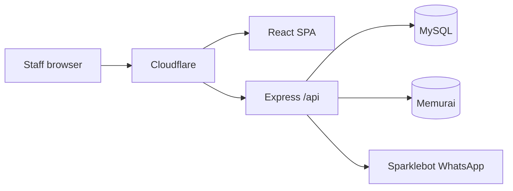

# BillVyapp

**Salon billing & operations platform for The Starr Kuts**

| | |
|---|---|
| **Live** | https://billvyapp.com |
| **Release** | Production **V1** |
| **Stack** | React (Vite) · Express · Prisma · MySQL · WhatsApp (Sparklebot) |

---

## Architecture (V1)

Full as-built documentation:

### **[ARCHITECTURE.md](./ARCHITECTURE.md)** — complete V1 system architecture

That document covers frontend, backend modules, MySQL schema, auth (JWT + WhatsApp OTP), BullMQ/Redis, Sparklebot WhatsApp, deployment on Windows EC2 + Cloudflare, and key flows (walk-in billing, coupons, feedback).



---

## Repository

| Path | Description |
|------|-------------|
| `Frontend folder/` | Vite + React 18 SPA (port **5173**) |
| `backend/` | Express API + Prisma (port **4000**) |
| `docs/` | Status reports, WhatsApp/SMS templates |
| `ARCHITECTURE.md` | **V1 architecture (source of truth)** |

**Remotes**

- Development: `origin` → [BillVyapp](https://github.com/MetaForge-IT/BillVyapp)
- Production: `production` → [BillVyapp-Production](https://github.com/MetaForge-IT/BillVyapp-Production)

---

## Quick start (local)

```bash
# API
cd backend
cp .env.prod.example .env   # or use existing .env
npm install
npx prisma migrate deploy
npm run dev                 # http://localhost:4000

# SPA (new terminal)
cd "Frontend folder"
npm install
npm run dev                 # http://localhost:5173
```

Optional: install **Memurai** (Windows Redis) and set `REDIS_URL=redis://127.0.0.1:6379` for BullMQ WhatsApp queues.

---

## V1 capabilities

- Walk-in POS & appointments  
- Customers, memberships, coupons  
- Inventory & vendors  
- Finance / expenses / receipts  
- Manager & admin dashboards  
- WhatsApp: login OTP, payment received, coupons, feedback  
- In-app notifications  

**Pending credentials:** SMTP, SMS API, Razorpay (UPI QR in use today).

---

## Status

See [docs/BillVyapp-Project-Status-Report-2026-08-07.md](./docs/BillVyapp-Project-Status-Report-2026-08-07.md) and the Excel report in `docs/`.

---

## License / ownership

Proprietary — MetaForge IT / The Starr Kuts. All rights reserved.
